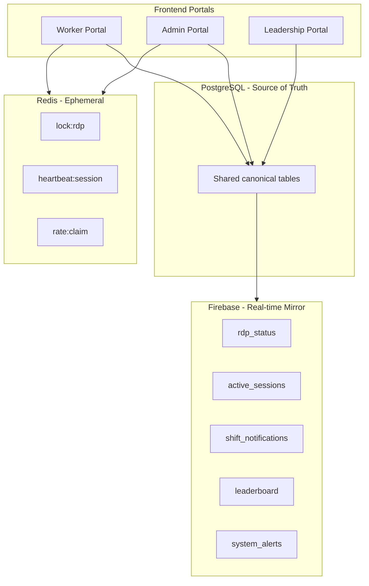
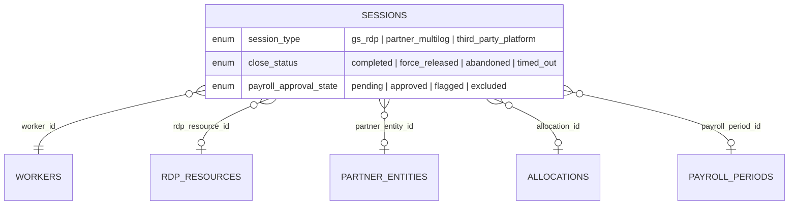
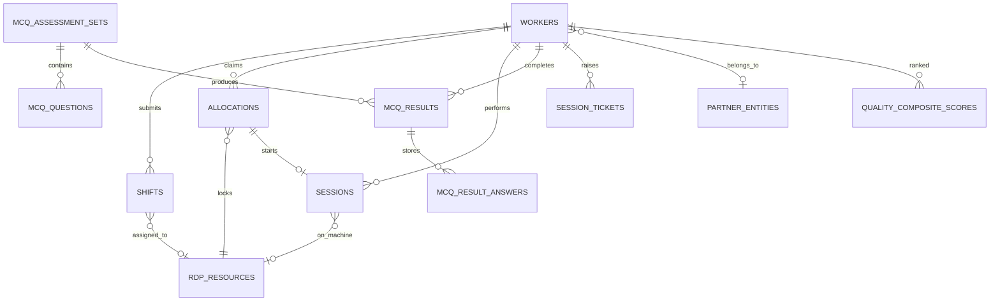
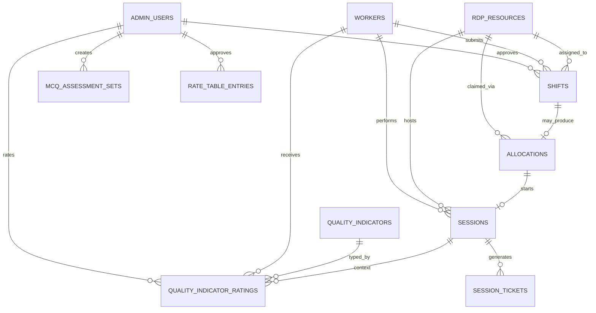
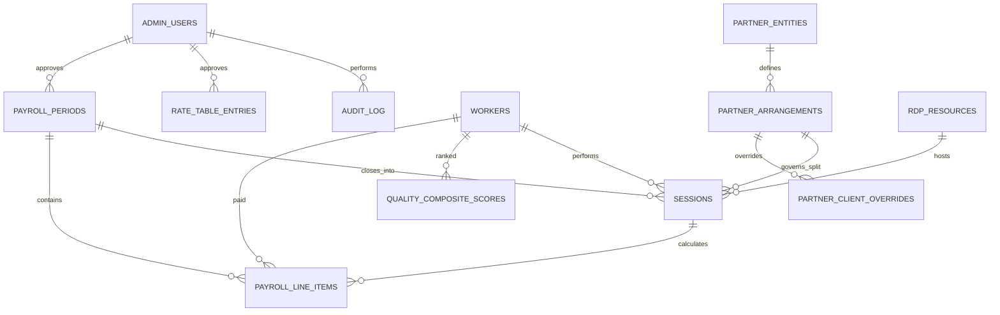
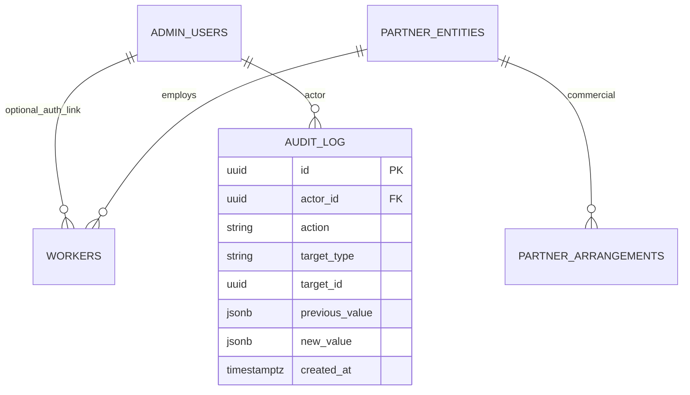
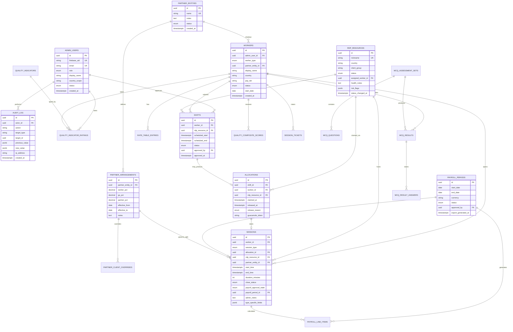

**Document:** Phase 0 canonical database specification  
**Version:** 1.1  
**Status:** Requirements lock — pending GlobalSolutions approval  
**Charter reference:** Project Charter V2.0 (90-Day Delivery Plan)

---

## What is a data model?

A **data model** is the formal blueprint for how information is stored, related, and constrained in the platform. It answers:

- **What entities exist?** (workers, sessions, RDP machines, payroll periods, etc.)
- **What fields does each entity carry?** (name, type, timestamps, status)
- **How do entities relate?** (a session belongs to one worker; a partner worker belongs to one partner entity)
- **What rules must always hold?** (no double RDP claims, audit log is append-only, split percentages must sum to 100%)

For GlobalSolutions, the data model is the contract between business requirements and the PostgreSQL schema that FastAPI will implement. Every session allocation, payroll calculation, and quality score ultimately reads from or writes to these structures.

## What is an ERD?

An **Entity-Relationship Diagram (ERD)** is a visual map of the data model. Boxes represent **entities** (tables). Lines represent **relationships** (foreign keys). Cardinality markers show whether one worker has many sessions, one RDP machine has one active session, and so on.

Phase 0 requires a confirmed ERD before production build begins so that session allocation, double-claim prevention, and payroll accuracy are designed correctly from day one — not retrofitted after code is written.

---

## Storage strategy

| Layer | Technology | Role |
| :--- | :--- | :--- |
| **Source of truth** | PostgreSQL | Permanent, auditable, financially accurate records |
| **Real-time display** | Firebase | Live RDP board, active sessions, notifications, leaderboard |
| **Distributed locking** | Redis | Atomic RDP claim locks, session heartbeat state |

PostgreSQL holds the canonical record. Firebase mirrors live state written by the FastAPI backend. If Firebase is unavailable, historical data remains intact; if PostgreSQL is unavailable, new actions are rejected to protect integrity.

---

## How to read this document — scope layers

The platform is delivered through three portals, defined in `frontend/lib/auth/config.ts`. This document groups the data model into **scope layers** that match those portals, plus a **general layer** for cross-cutting entities and infrastructure that no single portal owns.

Scope here means *which role primarily needs the data*, not how the tables are physically structured. The PostgreSQL schema remains one shared set of tables (see Appendix A); a table can appear in more than one layer with different access scopes.

| Layer | Portal route | Auth role | Underlying DB role(s) |
| :--- | :--- | :--- | :--- |
| **Worker** | `/worker/*` | `worker` | `workers` row (GS or partner); optional `admin_user_id` for login |
| **Admin** | `/admin/*` | `admin` | `operations_lead`, `country_manager`, `technical_admin` |
| **Executive** | `/leadership/*` | `executive` | `ceo_leadership` |
| **General** | All / none | All | Cross-cutting: auth, audit, partner commercial model, infra |

**Layer index:**

| Layer | Primary data |
| :--- | :--- |
| **Worker layer** | shifts, RDP claim/allocations, sessions, MCQ assessments, own quality rank, leaderboard read |
| **Admin layer** | shift approval, RDP state machine, quality ratings, worker management, assessment authoring |
| **Executive layer** | payroll periods, payroll line items, commercial splits, rate approval, audit, utilisation |
| **General layer** | `admin_users`, `audit_log`, `partner_entities`, `partner_arrangements`, Firebase, Redis |

---

## Session-centric detail (core of the platform)

Every productive hour — whether on a GlobalSolutions RDP machine, a partner multilog client, or a third-party platform — is recorded as a **session**. This unified model powers leadership dashboards, payroll, and quality scoring, and it is the entity every layer ultimately reads from or writes to.

### Session type extensions (`type_specific_fields` JSONB)

| Session type | Additional persisted fields |
| :--- | :--- |
| **GS RDP** | `guacamole_connection_token`, `machine_health_at_start`, `machine_health_at_end`, `last_heartbeat_at` |
| **Partner multilog** | `multilog_client_name`, `partner_reference_id` |
| **Third-party platform** | `platform_name` (Handshake, Outlier, Prolific), `task_or_batch_reference`, `self_reported_duration_minutes`, `optional_reported_earnings` |

---

## Layer 1 — Worker portal

> **Build runbook:** Step-by-step implementation order, page-to-table mapping, and Firebase/Redis setup for this layer → [worker-layer-setup.md](worker-layer-setup.md).

### Data needs

Workers (both GS registered and partner workers) manage **their own** productivity: they submit shift availability, claim RDP machines, run and log sessions across all three channels, take MCQ assessments, view their quality rank, and read the live leaderboard. Workers only ever read or write rows that belong to them; the live RDP board is the one shared view they read.

### Worker-layer ERD

### Tables — worker read/write scope (PostgreSQL)

Full column-level definitions are in [Appendix A](#appendix-a--canonical-schema). This table lists the worker-facing subset and access scope.

| Table | Worker access | Key fields | Relationships |
| :--- | :--- | :--- | :--- |
| `workers` | Read/update own row | `id`, `worker_type`, `partner_entity_id`, `display_name`, `country`, `pay_tier`, `status` | FK → `partner_entities`; optional FK → `admin_users` |
| `shifts` | Create/read own | `worker_id`, `rdp_resource_id`, `scheduled_start`, `scheduled_end`, `status` | FK → `workers`, `rdp_resources`, `admin_users` (approver) |
| `rdp_resources` | Read board (no direct write) | `nickname`, `country`, `status`, `assigned_worker_id` | FK → `workers` when claimed |
| `allocations` | Create via claim; read own | `worker_id`, `rdp_resource_id`, `claimed_at`, `released_at`, `guacamole_token` | FK → `shifts`, `workers`, `rdp_resources` |
| `sessions` | Create/read own | `session_type`, `start_time`, `end_time`, `type_specific_fields` (JSONB) | FK → `workers`, `allocations`, `rdp_resources`, `partner_entities` |
| `mcq_assessment_sets` | Read active | `title`, `category`, `passing_score_pct` | — |
| `mcq_questions` | Read | `prompt`, `options`, `sort_order` | FK → `mcq_assessment_sets` |
| `mcq_results` | Create/read own | `score_pct`, `passed`, `completed_at` | FK → `workers`, `mcq_assessment_sets` |
| `mcq_result_answers` | Create/read own | `selected_option_key`, `is_correct` | FK → `mcq_results`, `mcq_questions` |
| `quality_composite_scores` | Read own rank | `composite_score`, `country_rank`, `global_rank`, `session_streak_days` | FK → `workers` |
| `session_tickets` | Create/read own (post-MVP) | `session_id`, `description`, `status` | FK → `sessions`, `workers` |
| `knowledge_base_articles` | Read published (post-MVP) | `title`, `body`, `published_at` | FK → `admin_users` (author) |
| `partner_entities` | Read-only (partner workers) | `name`, `status` | Referenced by `workers.partner_entity_id` |

### Firebase — worker-facing reads

| Path | Shape | When updated |
| :--- | :--- | :--- |
| `/rdp_status/{rdp_id}` | `{ status, worker_id, updated_at }` | RDP state change — worker reads the live board |
| `/active_sessions/{session_id}` | `{ worker_id, rdp_id, started_at, heartbeat_at }` | Own active session timer |
| `/shift_notifications/{worker_id}/{notif_id}` | `{ type, title, body, read, created_at }` | Shift approved/rejected, RDP assigned |
| `/leaderboard/current_period` | `{ workers: [...], refreshed_at }` | Leaderboard page (refreshed every 5 minutes) |

### Redis — worker-triggered

| Key | Purpose |
| :--- | :--- |
| `lock:rdp:{rdp_id}` | Claim transaction lock |
| `heartbeat:session:{session_id}` | Session keepalive |
| `rate:claim:{worker_id}` | Anti-abuse on claim attempts |

### Business rules (worker layer)

- Only one open allocation per RDP — enforced by a partial unique index on `allocations.rdp_resource_id WHERE released_at IS NULL`.
- A partner worker must have `partner_entity_id` set when `worker_type = 'partner_worker'`.
- Session types are `gs_rdp`, `partner_multilog`, `third_party_platform`, each with its own JSONB extension fields.

---

## Layer 2 — Admin portal

### Data needs

Operations staff run the day-to-day platform: they approve or reject shifts, assign and lock RDP machines, force-release stuck sessions, rate worker quality, manage worker records, triage tickets, and author MCQ assessments. This layer maps to three DB roles with different reach:

- `operations_lead` — global read/write on operations.
- `country_manager` — scoped to workers and sessions within their `country_scope`.
- `technical_admin` — RDP health and infrastructure metadata only; no payroll or PII by default.

### Admin-layer ERD

### Tables — admin read/write scope (PostgreSQL)

Full column-level definitions are in [Appendix A](#appendix-a--canonical-schema).

| Table | Admin access | Key fields | Relationships |
| :--- | :--- | :--- | :--- |
| `admin_users` | Read own profile | `role`, `country_scope`, `display_name` | Identity for ops actions |
| `workers` | Read/write (country-scoped for managers) | All worker columns | FK → `partner_entities`, `admin_users` |
| `shifts` | Approve/reject/assign RDP | `status`, `approved_by`, `rdp_resource_id`, `rejection_reason` | FK → `workers`, `rdp_resources`, `admin_users` |
| `rdp_resources` | Full ops control | `status` (8-state enum), `assigned_worker_id`, `health_notes`, `risk_flags`, `last_health_check_at` | FK → `workers`; central to state machine |
| `allocations` | Read all; force-release | `release_reason`, `released_at` | FK → `shifts`, `workers`, `rdp_resources` |
| `sessions` | Read all; force-release; `admin_notes` | `close_status`, `admin_notes`, `payroll_approval_state` | FK → `workers`, `allocations`, `rdp_resources` |
| `quality_indicators` | Read/configure | `code`, `weight_in_subjective_pool`, `input_mode` | — |
| `quality_indicator_ratings` | Create manual ratings | `score`, `reason_note`, `rated_by`, `session_id` | FK → `workers`, `quality_indicators`, `admin_users` |
| `mcq_assessment_sets` | Create/manage | `title`, `is_active`, `created_by` | FK → `admin_users` |
| `mcq_questions` | CRUD | `prompt`, `options`, `correct_option_key` | FK → `mcq_assessment_sets` |
| `rate_table_entries` | Create (leadership approves) | `amount`, `rate_type`, `effective_from`, `approved_by` | FK → `workers` or tier |
| `session_tickets` | Triage/resolve (post-MVP) | `status`, `resolved_by` | FK → `sessions`, `workers` |
| `knowledge_base_articles` | CRUD (post-MVP) | `title`, `body`, `version` | FK → `admin_users` |
| `audit_log` | Read (ops actions) | `action`, `target_type`, `target_id`, `previous_value`, `new_value` | FK → `actor_id` |

### Firebase — admin-facing

| Path | Admin use |
| :--- | :--- |
| `/rdp_status/*` | Live ops board — same mirror; admin triggers writes via API |
| `/active_sessions/*` | Monitor idle / abandoned sessions |
| `/system_alerts/{alert_id}` | Machine offline, idle session, and payroll exception triage |

### Redis — admin-triggered

Admins use the same claim and heartbeat keys as workers. A force-release clears the open allocation and updates Firebase as part of the transaction.

### Business rules (admin layer)

- Claim flow: Redis lock → PostgreSQL transaction → verify `rdp_resources.status = online_free` → set status `assigned` → write `audit_log` → mirror to Firebase → commit.
- Force-release requires a `reason_note`, which is written as an `audit_log` entry.
- Manual quality ratings require a mandatory `reason_note`.

---

## Layer 3 — Executive / Leadership portal

### Data needs

CEO and leadership view organisation-wide performance: payroll periods and exports, financial splits, the audit trail, utilisation, and quality rankings. This layer is read-heavy with a small set of high-trust approval actions on payroll periods and rate changes. It maps to the `ceo_leadership` DB role.

### Executive-layer ERD

### Tables — executive read/approve scope (PostgreSQL)

Full column-level definitions are in [Appendix A](#appendix-a--canonical-schema).

| Table | Executive access | Key fields | Relationships |
| :--- | :--- | :--- | :--- |
| `payroll_periods` | Open/approve/export | `label`, `start_date`, `end_date`, `status`, `export_generated_at` | FK → `admin_users` (approver) |
| `payroll_line_items` | Read/export | `gross_amount`, `worker_pct`, `gs_pct`, `partner_pct`, `worker_net`, `exception_flags` | FK → `payroll_periods`, `sessions`, `workers` |
| `sessions` | Read all; review `payroll_approval_state` | `payroll_approval_state`, `payroll_period_id`, `duration_minutes` | FK → `payroll_periods` |
| `rate_table_entries` | Approve | `amount`, `change_reason`, `approved_by` | FK → `workers`, `admin_users` |
| `partner_entities` | Read | `name`, `status` | — |
| `partner_arrangements` | Read/audit commercial terms | `worker_pct`, `gs_pct`, `partner_pct` (must sum to 100) | FK → `partner_entities` |
| `partner_client_overrides` | Read | Client-specific split overrides | FK → `partner_arrangements` |
| `quality_composite_scores` | Read org-wide rankings | `composite_score`, `country_rank`, `global_rank` | FK → `workers` |
| `workers` | Read global | Utilisation, country breakdown | — |
| `rdp_resources` | Read utilisation | Status distribution, assignment | — |
| `audit_log` | Full read | All material actions | Append-only |

### Firebase — executive-facing

| Path | Executive use |
| :--- | :--- |
| `/leaderboard/current_period` | Org-wide performance snapshot (calculated from PostgreSQL, refreshed every 5 minutes) |
| `/system_alerts/*` | Org-level incident visibility |

Executives do not write to Firebase directly; FastAPI mirrors after PostgreSQL commits.

### Business rules (executive layer)

- Split percentages must satisfy `worker_pct + gs_pct + partner_pct = 100.00` on both arrangements and payroll line items.
- Payroll exception flags are auto-generated on line items (missing fields, force-release without reason, hours deviation, percentages off 100%).
- Payroll period lifecycle: `open` → `calculated` → `approved` → `paid`.

---

## Layer 4 — General / cross-cutting

These entities and infrastructure are **not owned by a single portal** but are required across all layers. They are deliberately kept out of the three role layers because their scope spans the whole platform.

### General ERD

### Tables — general (PostgreSQL)

| Table | Why it is general | Storage |
| :--- | :--- | :--- |
| `admin_users` | Auth identity for admin and executive; optional login link for workers | PostgreSQL only |
| `audit_log` | Written on every material action across all portals; append-only | PostgreSQL only |
| `partner_entities` | Referenced by workers (Layer 1); commercial terms read by executives (Layer 3) | PostgreSQL only |
| `partner_arrangements` | Payroll split logic spanning sessions, payroll (Layer 3) and partner workers (Layer 1) | PostgreSQL only |
| `partner_client_overrides` | Client-specific commercial override layer | PostgreSQL only |

### Authentication (Firebase Auth — not a PostgreSQL table)

- Login tokens for all roles are issued by the same Firebase project.
- `admin_users.firebase_uid` and `workers.admin_user_id` link a Firebase UID to its PostgreSQL row.
- Role enforcement happens **server-side** on every FastAPI call, not in Firebase rules alone.

### Storage infrastructure summary

| Technology | Scope | Role layer? |
| :--- | :--- | :--- |
| **PostgreSQL** | All tables — canonical source of truth | No — general |
| **Firebase** | 5 collection paths — real-time UI mirror only | No — general |
| **Redis** | 3 key patterns — ephemeral locks and heartbeats | No — general |

---

## Tables appearing in multiple layers

The same physical table is often shared across layers with row-level or column-level scope differences. This is intentional — there is one schema, accessed differently per role.

| Table | Worker | Admin | Executive | Notes |
| :--- | :--- | :--- | :--- | :--- |
| `workers` | Own row | CRUD (scoped) | Read global | Same table, row-level scope |
| `sessions` | Own CRUD | All read + force-release | Payroll review | Core unified session model |
| `rdp_resources` | Read board | Full state machine | Utilisation read | Status enum shared |
| `shifts` | Submit own | Approve/assign | — | Worker creates, admin approves |
| `allocations` | Claim own | Force-release | — | Double-claim prevention |
| `quality_composite_scores` | Own rank | — | Org rankings | Calculated snapshot |
| `audit_log` | — | Ops read | Full read | Append-only, general |

---

# Appendix A — Canonical schema

The following is the complete, authoritative PostgreSQL schema. It is unchanged by the layering above and is the build reference for the SQLAlchemy models and Alembic migrations generated in Phase 1 Week 2.

## High-level ERD

## PostgreSQL table definitions

### 1. `admin_users`

Platform operators authenticated via Firebase Auth. Roles are enforced server-side on every API call.

| Column | Type | Constraints | Description |
| :--- | :--- | :--- | :--- |
| `id` | `UUID` | PK, default `gen_random_uuid()` | Internal primary key |
| `firebase_uid` | `VARCHAR(128)` | UNIQUE, NOT NULL | Firebase Auth UID |
| `email` | `VARCHAR(255)` | UNIQUE, NOT NULL | Login email |
| `role` | `admin_role_enum` | NOT NULL | See roles below |
| `display_name` | `VARCHAR(255)` | NOT NULL | Shown in audit log and UI |
| `country_scope` | `VARCHAR(64)` | NULL | Set for country managers; NULL = global |
| `status` | `account_status_enum` | NOT NULL, default `active` | `active`, `deactivated` |
| `created_at` | `TIMESTAMPTZ` | NOT NULL, default `now()` | Account creation |
| `updated_at` | `TIMESTAMPTZ` | NOT NULL, default `now()` | Last profile update |

**Roles (`admin_role_enum`):** `ceo_leadership`, `operations_lead`, `country_manager`, `technical_admin`

> Workers authenticate through the same Firebase project but are stored in `workers`, linked optionally via `admin_user_id`.

---

### 2. `workers`

Both GlobalSolutions registered workers and partner workers.

| Column | Type | Constraints | Description |
| :--- | :--- | :--- | :--- |
| `id` | `UUID` | PK | Worker record ID |
| `admin_user_id` | `UUID` | FK → `admin_users.id`, UNIQUE, NULL | Auth link when worker has login |
| `worker_type` | `worker_type_enum` | NOT NULL | `gs_registered`, `partner_worker` |
| `partner_entity_id` | `UUID` | FK → `partner_entities.id`, NULL | Required when `worker_type = partner_worker` |
| `display_name` | `VARCHAR(255)` | NOT NULL | Full name |
| `country` | `VARCHAR(64)` | NOT NULL | Country team assignment |
| `pay_tier` | `VARCHAR(64)` | NOT NULL | Rate tier label |
| `status` | `worker_status_enum` | NOT NULL | `active`, `inactive`, `suspended` |
| `start_date` | `DATE` | NOT NULL | Onboarding date |
| `created_at` | `TIMESTAMPTZ` | NOT NULL | Record created |
| `updated_at` | `TIMESTAMPTZ` | NOT NULL | Last update |

**Check constraint:** `partner_entity_id IS NOT NULL` when `worker_type = 'partner_worker'`.

**Frontend alignment:** Mock workers in `frontend/lib/mock-data.ts` use `type: 'GS Registered' | 'Partner Worker'` and optional `partner` name — maps directly to `worker_type` + `partner_entity_id`.

---

### 3. `partner_entities`

Organisations through which outsourced workers operate.

| Column | Type | Constraints | Description |
| :--- | :--- | :--- | :--- |
| `id` | `UUID` | PK | Partner ID |
| `name` | `VARCHAR(255)` | UNIQUE, NOT NULL | Partner organisation name |
| `notes` | `TEXT` | NULL | Relationship notes |
| `status` | `entity_status_enum` | NOT NULL | `active`, `inactive` |
| `created_at` | `TIMESTAMPTZ` | NOT NULL | Record created |

---

### 4. `partner_arrangements`

Default revenue-split structure per partner.

| Column | Type | Constraints | Description |
| :--- | :--- | :--- | :--- |
| `id` | `UUID` | PK | Arrangement ID |
| `partner_entity_id` | `UUID` | FK, NOT NULL | Partner this arrangement belongs to |
| `worker_pct` | `NUMERIC(5,2)` | NOT NULL | Worker share (e.g. 70.00) |
| `gs_pct` | `NUMERIC(5,2)` | NOT NULL | GlobalSolutions share |
| `partner_pct` | `NUMERIC(5,2)` | NOT NULL | Partner share |
| `effective_from` | `DATE` | NOT NULL | Start of arrangement |
| `effective_to` | `DATE` | NULL | End date; NULL = current |
| `notes` | `TEXT` | NULL | Commercial terms |

**Check constraint:** `worker_pct + gs_pct + partner_pct = 100.00`

---

### 5. `partner_client_overrides`

Client-specific percentage overrides within a partner arrangement.

| Column | Type | Constraints | Description |
| :--- | :--- | :--- | :--- |
| `id` | `UUID` | PK | Override ID |
| `partner_arrangement_id` | `UUID` | FK, NOT NULL | Parent arrangement |
| `client_name` | `VARCHAR(255)` | NOT NULL | Client or account holder |
| `worker_pct` | `NUMERIC(5,2)` | NOT NULL | Override worker share |
| `gs_pct` | `NUMERIC(5,2)` | NOT NULL | Override GS share |
| `partner_pct` | `NUMERIC(5,2)` | NOT NULL | Override partner share |
| `effective_from` | `DATE` | NOT NULL | Override start |
| `notes` | `TEXT` | NULL | Reason for override |

---

### 6. `rdp_resources`

GlobalSolutions RDP machines managed through the 8-state machine.

| Column | Type | Constraints | Description |
| :--- | :--- | :--- | :--- |
| `id` | `UUID` | PK | Internal machine ID |
| `nickname` | `VARCHAR(64)` | UNIQUE, NOT NULL | Display ID (e.g. `RDP-KE-001`) |
| `country` | `VARCHAR(64)` | NOT NULL | Geographic grouping |
| `client_group` | `VARCHAR(128)` | NOT NULL | Client/account grouping |
| `status` | `rdp_status_enum` | NOT NULL | Current state (see below) |
| `assigned_worker_id` | `UUID` | FK → `workers.id`, NULL | Worker with current claim |
| `guacamole_connection_id` | `VARCHAR(128)` | NULL | Server-side Guacamole reference |
| `health_notes` | `TEXT` | NULL | Admin/ops notes |
| `risk_flags` | `JSONB` | default `'[]'` | Structured risk markers |
| `last_health_check_at` | `TIMESTAMPTZ` | NULL | Last Uptime Kuma / port check |
| `status_changed_at` | `TIMESTAMPTZ` | NOT NULL | Last state transition |

**RDP status enum (`rdp_status_enum`):**

| Value | Meaning |
| :--- | :--- |
| `offline` | Unreachable or powered off |
| `online_free` | Available for claiming |
| `assigned` | Allocated; session not yet active |
| `active` | Live worker session |
| `idle` | Session open; heartbeat exceeded threshold |
| `unhealthy` | Reachable but port/health check failing |
| `admin_locked` | Manually locked by leadership |
| `maintenance` | Under maintenance |

**Frontend alignment:** `frontend/lib/mock-data.ts` → `machines[]` with `status` values map 1:1 to this enum.

---

### 7. `shifts`

Worker availability submissions and admin-approved schedules.

| Column | Type | Constraints | Description |
| :--- | :--- | :--- | :--- |
| `id` | `UUID` | PK | Shift ID |
| `worker_id` | `UUID` | FK, NOT NULL | Submitting worker |
| `rdp_resource_id` | `UUID` | FK, NULL | Assigned machine after approval |
| `scheduled_start` | `TIMESTAMPTZ` | NOT NULL | Planned start |
| `scheduled_end` | `TIMESTAMPTZ` | NOT NULL | Planned end |
| `status` | `shift_status_enum` | NOT NULL | `pending`, `approved`, `rejected`, `cancelled` |
| `approved_by` | `UUID` | FK → `admin_users.id`, NULL | Approving admin |
| `approved_at` | `TIMESTAMPTZ` | NULL | Approval timestamp |
| `rejection_reason` | `TEXT` | NULL | Required when rejected |
| `created_at` | `TIMESTAMPTZ` | NOT NULL | Submission time |

---

### 8. `allocations`

Atomic claim records linking a worker to an RDP at a point in time. Central to **double-claim prevention**.

| Column | Type | Constraints | Description |
| :--- | :--- | :--- | :--- |
| `id` | `UUID` | PK | Allocation ID |
| `shift_id` | `UUID` | FK → `shifts.id`, NULL | Originating approved shift |
| `worker_id` | `UUID` | FK, NOT NULL | Claiming worker |
| `rdp_resource_id` | `UUID` | FK, NOT NULL | Claimed machine |
| `claimed_at` | `TIMESTAMPTZ` | NOT NULL | Claim timestamp |
| `released_at` | `TIMESTAMPTZ` | NULL | Release timestamp |
| `release_reason` | `release_reason_enum` | NULL | Why session ended |
| `guacamole_token` | `VARCHAR(512)` | NULL | Short-lived connection token |
| `created_at` | `TIMESTAMPTZ` | NOT NULL | Record created |

**Critical constraint:** Partial unique index on `rdp_resource_id WHERE released_at IS NULL` — only one open allocation per machine at any time.

**Claim flow (Phase 1 acceptance):**
1. Redis distributed lock acquired on `rdp:{id}`
2. PostgreSQL transaction: verify `rdp_resources.status = online_free`
3. Update status → `assigned`, insert `allocations` row, write `audit_log`
4. Mirror to Firebase; commit transaction
5. Second concurrent claim fails at step 2 or unique index

---

### 9. `sessions`

Unified session log for all three session types.

| Column | Type | Constraints | Description |
| :--- | :--- | :--- | :--- |
| `id` | `UUID` | PK | Session ID |
| `worker_id` | `UUID` | FK, NOT NULL | Worker who performed the work |
| `session_type` | `session_type_enum` | NOT NULL | See session types |
| `allocation_id` | `UUID` | FK → `allocations.id`, NULL | Set for GS RDP sessions |
| `rdp_resource_id` | `UUID` | FK, NULL | Set for GS RDP sessions |
| `partner_entity_id` | `UUID` | FK, NULL | Set for partner / some third-party sessions |
| `partner_arrangement_id` | `UUID` | FK, NULL | Arrangement used for payroll split |
| `start_time` | `TIMESTAMPTZ` | NOT NULL | Session start |
| `end_time` | `TIMESTAMPTZ` | NULL | Session end |
| `duration_minutes` | `INTEGER` | NULL | Calculated on close |
| `close_status` | `session_close_enum` | NULL | How session ended |
| `payroll_approval_state` | `payroll_session_enum` | NOT NULL, default `pending` | Payroll review state |
| `payroll_period_id` | `UUID` | FK, NULL | Assigned after period close |
| `admin_notes` | `TEXT` | NULL | Admin corrections / context |
| `type_specific_fields` | `JSONB` | NOT NULL, default `'{}'` | Type-specific payload |
| `created_at` | `TIMESTAMPTZ` | NOT NULL | Record created |
| `updated_at` | `TIMESTAMPTZ` | NOT NULL | Last update |

**Session type enum:** `gs_rdp`, `partner_multilog`, `third_party_platform`

**Close status enum:** `completed`, `force_released`, `abandoned`, `timed_out`

---

### 10. `rate_table_entries`

Worker or tier base rates for payroll calculation.

| Column | Type | Constraints | Description |
| :--- | :--- | :--- | :--- |
| `id` | `UUID` | PK | Rate entry ID |
| `worker_id` | `UUID` | FK, NULL | Worker-specific rate |
| `pay_tier` | `VARCHAR(64)` | NULL | Tier-level rate when worker_id NULL |
| `rate_type` | `rate_type_enum` | NOT NULL | `hourly`, `per_task` |
| `amount` | `NUMERIC(12,2)` | NOT NULL | Base rate amount |
| `currency` | `CHAR(3)` | NOT NULL | ISO currency code |
| `effective_from` | `DATE` | NOT NULL | Rate start date |
| `effective_to` | `DATE` | NULL | Rate end date |
| `change_reason` | `TEXT` | NOT NULL | Why rate changed |
| `approved_by` | `UUID` | FK → `admin_users.id`, NOT NULL | Approving admin |
| `created_at` | `TIMESTAMPTZ` | NOT NULL | Record created |

---

### 11. `payroll_periods`

Bounded windows for payroll export and approval.

| Column | Type | Constraints | Description |
| :--- | :--- | :--- | :--- |
| `id` | `UUID` | PK | Period ID |
| `label` | `VARCHAR(64)` | NOT NULL | e.g. `2026-05` |
| `start_date` | `DATE` | NOT NULL | Period start (inclusive) |
| `end_date` | `DATE` | NOT NULL | Period end (inclusive) |
| `currency` | `CHAR(3)` | NOT NULL | Base currency for export |
| `status` | `payroll_period_enum` | NOT NULL | `open`, `calculated`, `approved`, `paid` |
| `approved_by` | `UUID` | FK, NULL | Leadership approver |
| `export_generated_at` | `TIMESTAMPTZ` | NULL | Last export timestamp |
| `created_at` | `TIMESTAMPTZ` | NOT NULL | Period opened |

---

### 12. `payroll_line_items`

Per-worker, per-session payroll calculation output.

| Column | Type | Constraints | Description |
| :--- | :--- | :--- | :--- |
| `id` | `UUID` | PK | Line item ID |
| `payroll_period_id` | `UUID` | FK, NOT NULL | Parent period |
| `session_id` | `UUID` | FK, NOT NULL | Source session |
| `worker_id` | `UUID` | FK, NOT NULL | Paid worker |
| `session_type` | `session_type_enum` | NOT NULL | Channel type |
| `gross_amount` | `NUMERIC(12,2)` | NOT NULL | Before splits |
| `worker_pct` | `NUMERIC(5,2)` | NOT NULL | Applied worker % |
| `gs_pct` | `NUMERIC(5,2)` | NOT NULL | Applied GS % |
| `partner_pct` | `NUMERIC(5,2)` | NOT NULL | Applied partner % |
| `worker_net` | `NUMERIC(12,2)` | NOT NULL | Net to worker |
| `gs_net` | `NUMERIC(12,2)` | NOT NULL | Net to GS |
| `partner_net` | `NUMERIC(12,2)` | NOT NULL | Net to partner |
| `exception_flags` | `JSONB` | default `'[]'` | Auto-generated flags |
| `created_at` | `TIMESTAMPTZ` | NOT NULL | Calculated at |

**Auto exception flags:** missing required fields, force-released without reason, hours deviation from shift, percentages ≠ 100%.

---

### 13. Quality scoring tables

#### `quality_indicators`

Generic indicator definitions — extensible without schema changes.

| Column | Type | Description |
| :--- | :--- | :--- |
| `id` | `UUID` | PK |
| `code` | `VARCHAR(64)` | UNIQUE — e.g. `organisation`, `communication` |
| `name` | `VARCHAR(128)` | Display name |
| `description` | `TEXT` | What it measures |
| `weight_in_subjective_pool` | `NUMERIC(5,2)` | Share of the 50% subjective half |
| `input_mode` | `indicator_input_enum` | `auto`, `manual` |
| `scale_min` | `SMALLINT` | e.g. 1 |
| `scale_max` | `SMALLINT` | e.g. 5 |
| `is_active` | `BOOLEAN` | Whether included in composite |

**Confirmed indicators at MVP:**

| Code | Weight (of 50% subjective) | Input |
| :--- | :--- | :--- |
| `mcq_assessment` | 50% of **total** score (separate pool) | Auto from MCQ results |
| `organisation` | Configurable share of subjective 50% | Auto from session punctuality |
| `communication` | Configurable share of subjective 50% | Manual admin rating + mandatory reason |

#### `quality_indicator_ratings`

| Column | Type | Description |
| :--- | :--- | :--- |
| `id` | `UUID` | PK |
| `worker_id` | `UUID` | FK → workers |
| `indicator_id` | `UUID` | FK → quality_indicators |
| `score` | `NUMERIC(5,2)` | Rating value |
| `reason_note` | `TEXT` | Mandatory for manual ratings |
| `rated_by` | `UUID` | FK → admin_users |
| `session_id` | `UUID` | FK, NULL — optional context link |
| `created_at` | `TIMESTAMPTZ` | Rating timestamp |

#### `quality_composite_scores`

| Column | Type | Description |
| :--- | :--- | :--- |
| `id` | `UUID` | PK |
| `worker_id` | `UUID` | FK |
| `mcq_component` | `NUMERIC(5,2)` | 50% weighted MCQ score |
| `subjective_component` | `NUMERIC(5,2)` | 50% weighted subjective score |
| `composite_score` | `NUMERIC(5,2)` | Final score |
| `country_rank` | `INTEGER` | Rank within country |
| `global_rank` | `INTEGER` | Organisation-wide rank |
| `session_streak_days` | `INTEGER` | Consecutive days with completed session |
| `calculated_at` | `TIMESTAMPTZ` | Snapshot time |

---

### 14. MCQ assessment tables

#### `mcq_assessment_sets`

| Column | Type | Description |
| :--- | :--- | :--- |
| `id` | `UUID` | PK |
| `title` | `VARCHAR(255)` | Assessment name |
| `category` | `VARCHAR(128)` | e.g. Technical, Compliance |
| `passing_score_pct` | `NUMERIC(5,2)` | Minimum pass threshold |
| `is_active` | `BOOLEAN` | Available for assignment |
| `created_by` | `UUID` | FK → admin_users |

#### `mcq_questions`

| Column | Type | Description |
| :--- | :--- | :--- |
| `id` | `UUID` | PK |
| `assessment_set_id` | `UUID` | FK |
| `prompt` | `TEXT` | Question text |
| `options` | `JSONB` | Array of answer options |
| `correct_option_key` | `VARCHAR(8)` | Key of correct answer |
| `sort_order` | `INTEGER` | Display order |

#### `mcq_results`

| Column | Type | Description |
| :--- | :--- | :--- |
| `id` | `UUID` | PK |
| `worker_id` | `UUID` | FK |
| `assessment_set_id` | `UUID` | FK |
| `score_pct` | `NUMERIC(5,2)` | Achieved score |
| `passed` | `BOOLEAN` | Met passing threshold |
| `completed_at` | `TIMESTAMPTZ` | Completion time |

#### `mcq_result_answers`

| Column | Type | Description |
| :--- | :--- | :--- |
| `id` | `UUID` | PK |
| `mcq_result_id` | `UUID` | FK |
| `question_id` | `UUID` | FK |
| `selected_option_key` | `VARCHAR(8)` | Worker's answer |
| `is_correct` | `BOOLEAN` | Graded result |

---

### 15. `audit_log` (append-only)

Every material action is permanently attributable.

| Column | Type | Constraints | Description |
| :--- | :--- | :--- | :--- |
| `id` | `UUID` | PK | Log entry ID |
| `actor_id` | `UUID` | FK, NULL | Admin or worker user ID |
| `action` | `VARCHAR(64)` | NOT NULL | e.g. `CLAIM`, `FORCE_RELEASE`, `PAYROLL_APPROVE` |
| `target_type` | `VARCHAR(64)` | NOT NULL | e.g. `rdp_resource`, `session`, `worker` |
| `target_id` | `UUID` | NOT NULL | Entity affected |
| `previous_value` | `JSONB` | NULL | State before |
| `new_value` | `JSONB` | NULL | State after |
| `reason_note` | `TEXT` | NULL | Required for overrides |
| `ip_address` | `INET` | NULL | Client IP when available |
| `created_at` | `TIMESTAMPTZ` | NOT NULL | Immutable timestamp |

**Rule:** No UPDATE or DELETE privileges on this table for application roles.

---

### 16. Supporting tables (post-MVP / charter appendix)

#### `session_tickets`

Worker-reported issues tied to a session for admin triage.

| Column | Type | Description |
| :--- | :--- | :--- |
| `id` | `UUID` | PK |
| `session_id` | `UUID` | FK |
| `worker_id` | `UUID` | FK |
| `description` | `TEXT` | Issue detail |
| `status` | `ticket_status_enum` | `open`, `under_review`, `resolved` |
| `resolved_by` | `UUID` | FK, NULL |
| `created_at` | `TIMESTAMPTZ` | Submitted |

#### `knowledge_base_articles`

Admin-managed SOP and task guidance for workers.

| Column | Type | Description |
| :--- | :--- | :--- |
| `id` | `UUID` | PK |
| `title` | `VARCHAR(255)` | Article title |
| `body` | `TEXT` | Markdown content |
| `version` | `INTEGER` | Version number |
| `published_at` | `TIMESTAMPTZ` | When live |
| `created_by` | `UUID` | FK → admin_users |

---

# Appendix B — Real-time and ephemeral storage

These stores hold no canonical data. Firebase mirrors live state for UI; Redis holds short-lived coordination keys. Both are part of the **general layer** because they serve every portal.

## Firebase real-time collections

Firebase is **not** the source of truth. FastAPI writes here after every PostgreSQL commit for live UI updates.

| Path | Document shape | Updated when |
| :--- | :--- | :--- |
| `/rdp_status/{rdp_id}` | `{ status, worker_id, updated_at }` | RDP state machine transition |
| `/active_sessions/{session_id}` | `{ worker_id, rdp_id, started_at, heartbeat_at }` | Session start, heartbeat, end |
| `/shift_notifications/{worker_id}/{notif_id}` | `{ type, title, body, read, created_at }` | Shift approved/rejected, RDP assigned |
| `/leaderboard/current_period` | `{ workers: [{ id, score, country_rank, global_rank, streak }], refreshed_at }` | Every 5 minutes |
| `/system_alerts/{alert_id}` | `{ type, severity, message, entity_ref, created_at }` | Machine offline, idle session, payroll exception |

## Redis keys

| Key pattern | Purpose | TTL |
| :--- | :--- | :--- |
| `lock:rdp:{rdp_id}` | Distributed claim lock | 30 seconds (renewed during claim txn) |
| `heartbeat:session:{session_id}` | Last heartbeat timestamp | Session duration + buffer |
| `rate:claim:{worker_id}` | Claim attempt rate limiting | 60 seconds |

---

## User roles → data access

This matrix links the DB roles to the portal layers above.

| Role | Layer | PostgreSQL scope | Typical operations |
| :--- | :--- | :--- | :--- |
| **CEO / Leadership** | Executive | Global read; payroll export | Organisation command, financial reports, audit read |
| **Operations lead** | Admin | Global read/write ops | Shift approval, RDP assign/lock, force-release, quality ratings |
| **Country manager** | Admin | Country-scoped workers/sessions | View and limited admin within `country_scope` |
| **GS registered worker** | Worker | Own worker row + own sessions | Claim RDP, log GS RDP sessions, assessments, leaderboard |
| **Partner worker** | Worker | Own worker row + own sessions | Log multilog / third-party sessions, assessments, leaderboard |
| **Technical admin** | Admin | Infrastructure metadata only | RDP health config; no payroll or PII by default |

---

## Phase 0 deliverable checklist

| Item | Status in repo |
| :--- | :--- |
| Repository structure defined | ✅ `README.md` folder layout |
| Data model documented (this file) | ✅ `docs/data-models.md` |
| ERD produced | ✅ Mermaid diagrams above |
| User roles defined | ✅ Charter + `frontend/lib/auth/config.ts` (demo roles) |
| Wireframes for major screens | ✅ Implemented as Next.js pages under `frontend/app/` |
| Sprint plan for remaining 83 days | ⬜ To be added in `docs/phase-progress.md` |
| GlobalSolutions approval | ⬜ Pending review |

---

## Implementation notes

1. **Backend models not yet coded** — `backend/` is scaffolded in README; SQLAlchemy models in `backend/models/` are planned but not committed. This document is the build reference.
2. **Frontend uses mock data** — `frontend/lib/mock-data.ts` reflects the entities above for UI development ahead of API wiring.
3. **Migrations** — Alembic migrations will be generated from these definitions during Phase 1 Week 2.
4. **Charter amendments included** — Extended worker model, three session types, variable payroll percentages, 50/50 quality weighting, deferred WhatsApp, and Claude AI placeholder are all reflected in schema design.
5. **Layering is documentation only** — the scope layers above do not change the schema; they describe which portal role primarily needs each table. The canonical schema in Appendix A remains one shared set of tables.

---

*Prepared for GlobalSolutions Phase 0 — Requirements Lock. Confidential.*
