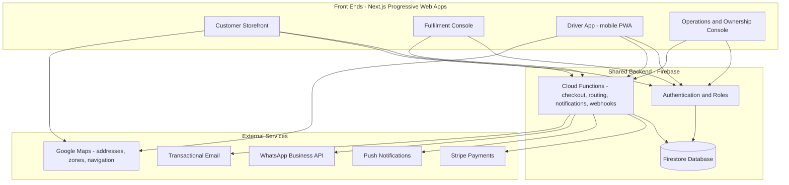
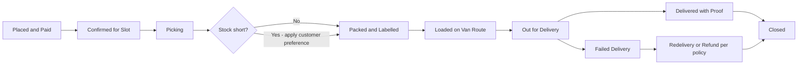
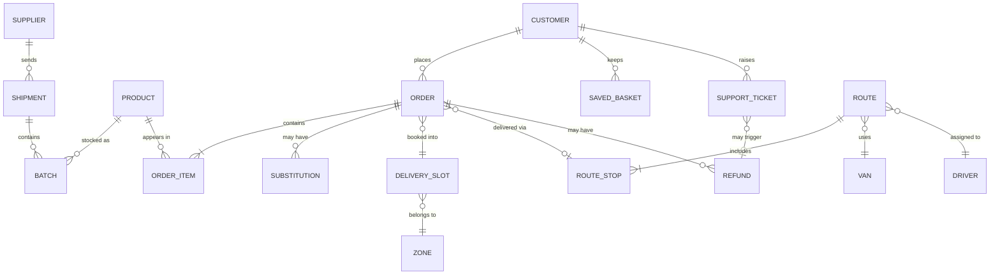

# TECHNICAL SCOPE PACK

## Mosh's London Specialist Delivery Platform

**A full technical scope converting the July 2026 planning brief into agreed functionality, technical choices, delivery milestones, responsibilities, dependencies and commercial terms — for Mosh's review and approval.**

**Prepared by:** Kelvin — GlobalSolutions
*Remote - Smart - Global*

**Date:** July 2026
**Status:** Confidential working document — draft for Mosh's review
**Document purpose:** This is the full scope pack requested in Section 7 of the planning brief ("What Kelvin should produce after the discovery stage"). It is written so that Mosh can review and approve it without a technical background, and so that development can begin against it once the decision gate in Section 8 is passed. Cost figures are placeholders to be completed after the discovery meeting.

**Contents**

1. Executive summary — how the system works
2. User journeys and wireframe descriptions
3. Functional requirements catalogue
4. Technical architecture
5. Operations configuration model
6. Data and analytics plan
7. Delivery plan and estimate
8. Responsibilities, discovery questions and safeguards

---

# 1. Executive Summary — How the System Works

## 1.1 What is being built

One platform, presented as **four connected applications** that all share the same backend and database:

| Application | Who uses it | What they do with it |
|---|---|---|
| **Customer storefront** | London customers | Browse, search, build baskets, pay, choose delivery slots, track orders |
| **Fulfilment console** | Packers at the storage site | See picking queues, resolve substitutions, pack and label orders, prepare van loads |
| **Driver app** | The two van drivers | Receive routes, navigate stop-by-stop, contact customers, confirm delivery, record exceptions |
| **Operations & ownership console** | Mosh and ops staff | Manage products, prices, zones, slots, stock, orders, routes, refunds, staff and dashboards |

There is **one backend and one database** underneath all four. When a packer marks an order "packed", the customer's tracking screen updates and the operations board updates — because everyone is looking at the same live data, not copies of it.

## 1.2 The life of an order (plain-language walkthrough)

1. **Customer orders.** A customer opens the storefront on their phone, searches for products (including culturally familiar names), builds a basket — or taps "Reorder last basket" — enters their postcode, and is shown only the delivery days and time slots available for their zone. They set a substitution preference, pay by card, and receive a confirmation.
2. **The backend validates and records.** At the moment of checkout, the backend checks live stock, confirms the slot still has capacity, takes payment through Stripe, reserves the stock, and writes the order into the database. The order instantly appears on the operations board.
3. **Fulfilment picks and packs.** On the delivery day, the fulfilment console shows a picking queue grouped by route. If an item is short, the packer triggers the substitution flow — the system applies the customer's saved preference (substitute / refund / contact me) and adjusts the payment automatically. Bags are labelled with route and stop numbers, and a load checklist is produced per van.
4. **Operations dispatches.** Ops staff (or an automated first-pass grouping) cluster the day's orders by zone and slot into two van routes, respecting each van's configured capacity (orders, bags, stops). Each route is assigned to a driver.
5. **Driver delivers.** The driver opens the app, sees the ordered stop list, taps a stop to navigate (Google Maps), can message or call the customer through the app without exposing personal numbers, and confirms each delivery with a photo and/or recipient name. Failed deliveries follow the agreed rule (wait time, contact attempts, safe-drop policy) and are recorded with a reason.
6. **The data learns.** Every event — searches, views, baskets, substitutions, delivery times, failures, refunds — is captured. Dashboards show Mosh what sold, where, how dense each route was, and what to load on the next shipment. Over time this data powers the recommendations described in Section 6, without over-promising AI on day one.

## 1.3 System diagram

## 1.4 Order lifecycle states

Every order moves through a defined set of states. Each state change is timestamped and attributed, which is what makes the dashboards and accountability possible.

---

# 2. User Journeys and Wireframe Descriptions

Visual wireframes will be produced in the design stage of Phase 1. This section defines each journey screen-by-screen so the wireframes have an agreed basis, including the exception flows the planning brief flags: substitutions, failed delivery and refunds.

## 2.1 Customer journey

**Screen 1 — Home / Discover.** Category tiles (grouped by need, not narrowly by origin), a prominent search bar, "New in", "Back in stock", "Arriving soon" strips, and — for returning customers — a "Buy again" strip at the top. A postcode entry prompt appears before checkout can be reached, so nobody builds a basket they cannot receive.

**Screen 2 — Search and browse.** Search accepts English names, common variants and culturally familiar names (a synonyms field on each product powers this — see data model). Filters: category, availability, origin, price. Out-of-stock items remain visible, marked "Notify me", so demand is still captured.

**Screen 3 — Product detail.** Photos, price, pack size, provenance/origin story, condition notes (fresh/frozen/ambient), live availability ("Only 6 left" / "Next shipment expected w/c 20 July"), and suggested accompaniments.

**Screen 4 — Basket.** Line items with quantity steppers, running total, delivery-fee indicator showing the threshold for free/reduced delivery ("Add £8.50 more for free delivery"), and buttons: "Save this basket" (named, e.g. "Weekly shop") and suggested add-ons.

**Screen 5 — Checkout.** Address (Google-assisted capture, validated against active delivery zones), slot picker showing only available days/slots for that zone with per-slot pricing, substitution preference (substitute with similar / refund missing items / contact me first — remembered for next time), payment (Stripe: card, Apple Pay, Google Pay), and a clear cost summary: basket, delivery fee, any minimum-order adjustment.

**Screen 6 — Order tracking.** Status timeline matching the lifecycle in 1.4. Once the route starts, a live estimated arrival window. Notifications at: confirmed, packed (with any substitutions listed for approval where the preference requires it), out for delivery, driver approaching, delivered.

**Screen 7 — Account.** Order history with one-tap reorder, saved baskets, saved addresses, substitution preference, notification preferences, and "Report an issue" on any past order (missing item, quality, delivery problem) which opens a support ticket with photo upload.

**Exception — substitution (customer view).** If preference is "contact me first", the customer receives a notification with the proposed substitute and price, and approves or declines in one tap within a time window; no reply applies their fallback choice. Price differences are automatically charged/refunded through Stripe, never handled manually.

**Exception — refunds.** Customer requests via "Report an issue"; ops approves within configured limits (Section 5); refund executes through Stripe to the original payment method and appears in the customer's order history and the finance report.

## 2.2 Fulfilment journey

**Screen 1 — Goods in.** Record a shipment arrival against a supplier record: expected vs received quantities, condition notes, batch/expiry dates. Discrepancies flag automatically to ops.

**Screen 2 — Picking queue.** Orders for the day grouped by route, sequenced for efficient picking. Each pick line shows product, quantity, and batch guidance (oldest expiry first). Short stock triggers the substitution flow inline.

**Screen 3 — Substitution resolution.** Shows the customer's preference and, where relevant, sends the approval request. The packer sees the outcome (substitute X, refund line, or hold) before sealing the bag.

**Screen 4 — Pack and label.** Marks the order packed; prints/displays a bag label with order number, customer name, route and stop number, and bag count (e.g. "Bag 2 of 3, contains frozen").

**Screen 5 — Load checklist.** Per van: every order, bag count, frozen/fresh flags. The driver or loader ticks off each order as loaded; the route cannot start with unticked orders, which eliminates "left at the depot" failures.

**Also recorded here:** stock loss and waste (damaged, expired, spilled) with reasons — this feeds the stock-turn and waste reporting Mosh needs.

## 2.3 Driver journey

**Screen 1 — My route.** Today's route: stop count, bag totals, first stop, slot windows. A pre-departure vehicle check (configurable checklist) must be completed before the route can start.

**Screen 2 — Stop list.** Ordered stops with address, slot window, bag count and customer notes ("gate code 4471", "flat on 3rd floor"). Tapping a stop opens navigation in Google Maps.

**Screen 3 — At the door.** Contact customer (call/message routed through the platform — personal numbers are never exposed), mark delivered with proof (photo and/or recipient name), or record an exception.

**Exception — failed delivery.** The app enforces the agreed policy: minimum wait time, logged contact attempts, then the options allowed by policy (safe-drop with photo, deliver to neighbour with name, return to depot). Every failed delivery records a reason code, which feeds the exception dashboard and the redelivery/refund flow.

**Screen 4 — End of route.** Returns summary (undelivered orders and reasons), any customer-reported issues at the door, and mileage/finish confirmation.

## 2.4 Operations and ownership journey

**Screen 1 — Order board.** Live view of all orders by status and day, filterable by zone, slot and route. This is the room's shared source of truth.

**Screen 2 — Route builder.** For a given day/slot: map view of pending orders, automatic first-pass grouping by zone and postcode cluster, drag-and-drop adjustment, capacity meters per van (orders / bags / stops vs configured limits), and route assignment to drivers. Deliberately **semi-automated at launch** — the system proposes, a human confirms — per the planning brief's safeguard against assuming full automation on day one.

**Screen 3 — Catalogue manager.** Full product CRUD: names, synonyms, categories, origin story, photos, prices, pack sizes, fresh/frozen flags, visibility. Bulk import via spreadsheet for shipment arrivals.

**Screen 4 — Zones, slots and pricing.** Postcode-based zone editor, per-zone delivery days and slots, slot capacity caps, per-zone delivery fees, minimum order values, free-delivery thresholds and group/community-drop incentives. All changeable without a developer (Section 5).

**Screen 5 — Support desk.** Ticket queue from customer issue reports and driver exceptions, categorised (missing item, quality, delivery, payment), with customer contact log, refund actions within permission limits, and escalation to the owner above those limits.

**Screen 6 — Dashboards.** Defined in Section 6.

---

# 3. Functional Requirements Catalogue

Priorities: **Launch** (must exist to take the first real order) · **Phase 2** (retention and control) · **Phase 3** (data-led scaling) · **Out of scope** (explicitly not being built in this engagement).

## 3.1 Customer platform

| # | Feature | Priority | Notes |
|---|---|---|---|
| C1 | Product catalogue with categories, search, synonyms, provenance | Launch | Synonym search included at launch — core to the proposition |
| C2 | Live availability and out-of-stock display with "notify me" | Launch | Prevents selling unavailable stock; captures unmet demand |
| C3 | Basket, checkout, Stripe payment (card, Apple/Google Pay) | Launch | |
| C4 | Postcode-gated delivery zones and slot selection with per-slot fees | Launch | |
| C5 | Substitution preference at checkout | Launch | |
| C6 | Order tracking with status notifications | Launch | Live driver ETA once route starts |
| C7 | Account, order history, one-tap reorder of any past order | Launch | |
| C8 | Report-an-issue with photo upload | Launch | Feeds support desk |
| C9 | Reorder last basket, named saved baskets | Phase 2 | |
| C10 | Suggested accompaniments and bundles | Phase 2 | Rule-based first (ops-curated), data-driven later |
| C11 | Referral and loyalty credits | Phase 2 | |
| C12 | Pre-orders against incoming shipments | Phase 2 | |
| C13 | Subscriptions / recurring baskets | Phase 3 | |
| C14 | Personalised basket predictions and reorder reminders | Phase 3 | Requires accumulated order data |
| C15 | Native iOS/Android app-store apps | Out of scope | PWA is installable; native revisited post-launch if metrics justify |
| C16 | Rapid / on-demand delivery | Out of scope | Per planning brief: scheduled delivery only until route economics proven |

## 3.2 Fulfilment and inventory

| # | Feature | Priority | Notes |
|---|---|---|---|
| F1 | Supplier records and shipment/batch logging (expected vs received) | Launch | |
| F2 | Stock levels with batch expiry, low-stock alerts | Launch | |
| F3 | Picking queues grouped by route | Launch | |
| F4 | Substitution resolution flow | Launch | |
| F5 | Pack, label and per-van load checklist | Launch | |
| F6 | Waste and stock-loss recording with reasons | Launch | Lightweight at launch; reporting deepens in Phase 2 |
| F7 | Received-stock quality/condition workflow with photos | Phase 2 | |
| F8 | Demand-informed reorder suggestions for inbound shipments | Phase 3 | |

## 3.3 Driver platform

| # | Feature | Priority | Notes |
|---|---|---|---|
| D1 | Route view, ordered stop list, Google Maps navigation | Launch | |
| D2 | Masked customer contact (call/message via platform) | Launch | |
| D3 | Proof of delivery (photo, recipient name) | Launch | |
| D4 | Failed-delivery flow enforcing agreed policy with reason codes | Launch | |
| D5 | Pre-departure vehicle checklist | Launch | Simple configurable checklist |
| D6 | Live location sharing for customer ETA | Launch | Only while a route is active |
| D7 | Route-level time and mileage capture for cost reporting | Phase 2 | |

## 3.4 Operations and ownership platform

| # | Feature | Priority | Notes |
|---|---|---|---|
| O1 | Live order board | Launch | |
| O2 | Route builder: automatic first-pass grouping + manual adjustment, capacity caps | Launch | Semi-automated by design |
| O3 | Catalogue manager with bulk import | Launch | |
| O4 | Zone, slot, fee, minimum-order and threshold configuration | Launch | |
| O5 | Staff accounts and role permissions | Launch | Owner, ops, packer, driver |
| O6 | Support desk with refund controls and escalation limits | Launch | |
| O7 | Launch dashboard (Section 6.2 metrics) | Launch | |
| O8 | Route profitability reporting (density, time, distance per route) | Phase 2 | Needs D7 data |
| O9 | Customer retention and churn-risk views | Phase 3 | |
| O10 | Automated demand forecasting and dynamic route optimisation | Phase 3 | Only after data and policies exist — per scope safeguards |
| O11 | Demographic-based pricing | Out of scope | Explicitly excluded; all pricing tied to transparent operational variables |

---

# 4. Technical Architecture

This section names the recommended stack and — more importantly — explains how the parts work together and why each choice fits a two-van, London-first launch.

**Recommendation in one line:** Next.js progressive web apps on a Firebase backend, with Stripe for payments and Google Maps for geography.

**Alternatives considered and set aside for launch:**

- *Native iOS/Android apps (React Native or Flutter)* — roughly doubles front-end build and maintenance cost, adds app-store review delays to every release, and offers little benefit at launch volumes. Revisited in Phase 3+ if usage data justifies it; nothing in this architecture blocks that move.
- *Traditional server + PostgreSQL backend* — a solid pattern for large relational systems, but it requires ongoing server management, and the real-time behaviour this product depends on (live order boards, picking queues, driver tracking) would need to be built by hand. Firebase provides that behaviour out of the box at a fraction of the cost, and daily exports to an open warehouse (Section 6) prevent lock-in of the data itself.

## 4.1 Front ends — Next.js progressive web apps

All four applications are built with **Next.js (React)** and deployed as **progressive web apps (PWAs)**.

**How this works in practice:** each app is a website that behaves like an app. Customers reach the storefront through a normal link (shareable in WhatsApp community groups — a real acquisition channel for this audience), and can "install" it to their home screen in two taps. Drivers do the same on their work phones. There is no app store, no review delays, and every user is always on the latest version the moment it is deployed.

**Why this choice:** one codebase and skill set across all four apps keeps build and maintenance cost proportionate to a two-van operation. The main trade-off — PWAs have slightly weaker push-notification behaviour on iPhones than native apps — is mitigated because order updates also go out via WhatsApp/SMS (Section 4.4). Native apps remain a Phase 3+ option if download metrics justify them, and nothing in this architecture blocks that later.

The customer storefront, fulfilment console, driver app and operations console are separate front ends sharing common components, so a change to the storefront cannot break the driver app.

## 4.2 Backend — Firebase (Google Cloud)

The backend is **Firebase**, comprising three parts:

- **Firebase Authentication** handles sign-in for every user type. Each account carries a role (customer, driver, packer, ops, owner) and the database enforces what each role can see and do. A driver can only read their own route; a customer can only read their own orders; only owner-level accounts can approve refunds above the configured limit.
- **Firestore** is the single live database. Its defining feature is **real-time synchronisation**: when a packer marks an order packed, the operations board and the customer's tracking screen update within a second, with no refresh and no polling. This is precisely the behaviour an order board, a picking queue and a live route need, and building it on a conventional database would cost significant extra engineering.
- **Cloud Functions** are small server-side programs that run the logic that must never be trusted to a phone or browser: taking payment, reserving stock atomically at checkout (so two customers cannot buy the last item simultaneously), enforcing slot capacity, generating route groupings, sending notifications, and processing Stripe webhooks (payment confirmations, refunds).

**How a checkout actually flows through this:** the storefront sends the basket to a Cloud Function → the function re-checks stock and slot capacity inside a transaction → creates a Stripe payment → on success, decrements stock, writes the order, and returns confirmation → Firestore's sync pushes the new order onto the ops board instantly → a notification function sends the confirmation message.

**Why this choice:** Firebase scales to zero cost when idle and grows with usage — hosting costs at launch volumes are expected in the tens of pounds per month, not hundreds. It removes server management entirely (no machines to patch or monitor), carries Google Cloud's security and UK/EU data-residency options for GDPR compliance, and its real-time model matches this product's core workflows. The trade-off is a NoSQL data model requiring some deliberate design for reporting (addressed in 4.5) and a degree of vendor coupling; the mitigation is that the data model below is portable and daily exports to BigQuery (Section 6) keep all data in an open, queryable form.

## 4.3 Payments — Stripe

Stripe handles all money movement: card payments, Apple Pay and Google Pay at checkout, automatic partial charges/refunds when substitutions change an order's value, full and partial refunds from the support desk, and payout reconciliation reports for Mosh's bookkeeping. Card details never touch our systems — they go directly from the customer's device to Stripe — which drastically reduces compliance burden (PCI scope). **Dependency:** Mosh must open the Stripe account, as the platform's merchant of record (Section 8).

## 4.4 Notifications — layered by importance

- **Push notifications** (Firebase Cloud Messaging) for order status updates — free and instant.
- **WhatsApp Business API** for the messages that must land: order confirmed, out for delivery, driver approaching, substitution approval requests. WhatsApp is the natural channel for this customer base and the planning brief already anticipates WhatsApp-supported care.
- **Email** (transactional service, e.g. Resend/SendGrid) for receipts and refund confirmations — the paper trail.
- **In-app masked calling/messaging** between driver and customer, so personal phone numbers are never shared in either direction.

## 4.5 Mapping and geography — Google Maps Platform

- **Address capture:** autocomplete at checkout eliminates the mistyped-address failure mode.
- **Zone checking:** each delivery zone is a set of postcode districts (e.g. E6, IG11). The customer's postcode is checked against active zones before checkout, and zones are editable by ops without a developer.
- **Route grouping:** at launch, the system clusters orders by zone/postcode proximity and slot as a proposal; ops confirms and adjusts on a map view. Full algorithmic route optimisation is deliberately Phase 3 — with two vans and controlled zones, a human with a good map view plus automatic clustering is more reliable than an unproven algorithm, and far cheaper to build correctly.
- **Driver navigation:** stop-to-stop handoff into Google Maps; live driver location during active routes powers customer ETAs.

## 4.6 Data model

Key entities in plain terms:

- **Product** — name, synonyms (for culturally familiar search terms), category, origin/provenance, price, pack size, storage type (ambient/fresh/frozen), photos, visibility.
- **Batch** — a quantity of a product from a specific shipment with an expiry date; stock level is the sum of live batches, which is what makes expiry-first picking and waste tracking possible.
- **Zone** — named area defined by postcode districts, with its own delivery days, fees, minimum order and thresholds.
- **Delivery slot** — a zone + date + time window with a capacity cap; checkout decrements remaining capacity.
- **Order / order items** — the customer's purchase, its full status history, substitution preference and outcomes, payment references.
- **Route / route stops** — a dated, driver-assigned sequence of orders for one van, with per-stop status and proof of delivery.
- **Support ticket / refund** — categorised issues linked to orders, with approval trail.
- **Event log** — the append-only analytics record described in Section 6.

## 4.7 Hosting, security and compliance

- **Hosting:** Firebase App Hosting / Google Cloud, European region for data residency. No servers for Mosh's team to manage.
- **Access control:** enforced at the database layer by security rules keyed to roles — even a bug in an app cannot expose another user's data, because the database itself refuses the read.
- **Data protection (UK GDPR):** customer data collected is limited to what the service needs (name, contact, addresses, order history); customers can request export or deletion via support; driver location is captured only during active routes; masked contact protects both sides' phone numbers. A privacy policy and cookie notice are included in the build; Mosh, as data controller, must register with the ICO (Section 8).
- **Payment security:** delegated to Stripe as above.
- **Backups:** automated daily Firestore exports retained on a rolling schedule.

---

# 5. Operations Configuration Model

The test for this section, per the planning brief: **Mosh's team must be able to run the business without developer intervention.** Everything below is a screen in the operations console, not a request to Kelvin.

| Area | What ops can change themselves |
|---|---|
| Products | Add/edit/hide products, names, synonyms, photos, categories, origin stories, pack sizes; bulk-import a shipment's catalogue from a spreadsheet |
| Pricing | Product prices, per-zone delivery fees, free-delivery thresholds, minimum order values, slot-level fee differences, group-delivery incentives |
| Zones | Activate/deactivate postcode districts, create new zones, set per-zone delivery days |
| Slots | Weekly slot templates per zone, capacity caps per slot, one-off closures (holidays, van maintenance) |
| Stock | Record shipments, adjust levels, log waste with reasons, set low-stock alert thresholds |
| Drivers and vans | Add driver accounts, set per-van capacity (orders/bags/stops), edit vehicle checklists |
| Routes | Accept/adjust proposed groupings, reassign stops, reassign drivers |
| Policies | Substitution rules, failed-delivery rule parameters (wait time, contact attempts, safe-drop on/off), refund approval limits |
| Support | Manage tickets, issue refunds within limits, escalate above them |
| Staff | Invite staff, assign roles, deactivate accounts |

**Permission levels:**

- **Owner (Mosh):** everything, including pricing rules, refund limit configuration, staff management and financial reports.
- **Ops staff:** orders, routes, catalogue, stock, support within refund limits.
- **Packer:** fulfilment console only.
- **Driver:** driver app only, own routes only.

**What still needs a developer:** new feature types, new integrations, changes to checkout logic or security rules. The dividing line is deliberate: *configuration* is ops; *behaviour* is development.

---

# 6. Data and Analytics Plan

Principle carried over from the planning brief's safeguards: **no automated AI decisions before the data and policies exist.** The plan below captures the right events from day one so that later intelligence is built on real evidence, and each future recommendation is listed with the data it depends on.

## 6.1 Events captured from day one

| Event family | Examples | Why it matters |
|---|---|---|
| Discovery | Searches (including zero-result terms), product views, category browsing, notify-me requests | Reveals demand — including demand for products not yet stocked |
| Basket | Add/remove, basket abandonment, saved-basket usage | Shows friction and conversion problems |
| Checkout | Slot chosen, fees paid, substitution preference, payment success/failure | Revenue mechanics and slot demand |
| Fulfilment | Pick times, substitution rates per product, waste events | Operational cost and supply quality |
| Delivery | Per-stop times, distance, failures with reasons, proof-of-delivery timestamps | Route economics |
| Post-order | Issues raised, refunds, repeat purchase intervals | Retention and service quality |

Events are written to an append-only log and exported daily to **BigQuery** (Google's analytics warehouse), which keeps all history queryable forever, independent of the live database, at negligible cost at this scale.

## 6.2 Launch dashboard (day one)

- Orders and revenue by day, zone and slot; average basket value.
- Slot fill rates — which slots sell out, which run empty.
- Route density: stops per route, orders per van-hour, failed-delivery rate with reasons.
- Stock: sell-through by product since last shipment, days of cover, waste by reason.
- Top zero-result search terms — a direct shopping list for the next shipment.
- Support: tickets by category, resolution time, refund totals.

## 6.3 Intelligence roadmap — each item gated on its data

| Future capability | Phase | Data it depends on |
|---|---|---|
| Demand-by-zone shipment recommendations | Phase 2 reporting → Phase 3 automation | 8–12 weeks of sales + zero-result search data |
| Bundle suggestions ("bought together") | Phase 2 (ops-curated) → Phase 3 (data-driven) | Sufficient co-purchase volume per product pair |
| Route profitability and capacity recommendations (e.g. "Saturday demand in this cluster exceeds capacity — add a run or a collection point") | Phase 2 | Per-route time/distance capture (feature D7) |
| Reorder reminders and churn-risk flags | Phase 3 | Stable repeat-purchase intervals per customer |
| Dynamic route optimisation | Phase 3 | Proven route history to validate against human-built routes |

---

# 7. Delivery Plan and Estimate

## 7.1 Phases

**Phase 1 — Scope confirmation and design (3–4 weeks)**
Discovery answers from Mosh (Section 8) confirmed; delivery policies agreed; wireframes for all four apps; data model finalised; zone/slot/pricing rules documented; visual identity applied.
*Acceptance criteria:* Mosh signs off wireframes, the policy pack and this scope. **This is the decision gate — development effort does not start until it is passed.**

**Phase 2 — Launch-capable MVP (10–12 weeks)**
All features marked **Launch** in Section 3, delivered in three internal milestones:
1. Catalogue, stock and storefront browsing (weeks 1–4)
2. Checkout, payments, zones/slots, order board (weeks 5–8)
3. Fulfilment console, driver app, notifications, dashboards (weeks 9–12)

*Testing approach:* automated tests on checkout, stock reservation and payment flows; end-to-end rehearsals of the full order journey; a **pilot week** of real orders from friends/family/community contacts in one zone with both vans before public launch.
*Acceptance criteria:* a real paid order flows from checkout to proof of delivery without developer involvement; ops staff complete a full day's operation using only the consoles; agreed dashboard metrics populate from pilot data.

**Phase 3 — Retention and control (6–8 weeks, post-launch)**
Features marked **Phase 2** in Section 3: saved/repeat baskets, curated bundles, pre-orders, referral credits, route profitability reporting, deeper stock workflows.
*Acceptance criteria:* per-feature, agreed at the start of the phase against live metrics (e.g. "reorder-last-basket used by X% of repeat customers").

**Phase 4 — Data-led scaling (scoped separately, after ~3 months of live data)**
Features marked **Phase 3** in Section 3. Deliberately not estimated now — per the scope safeguards, committing to AI-driven features before the data exists would be premature. Re-scoped as a follow-on engagement with the live dashboards as evidence.

## 7.2 Dependencies (blockers before or during Phase 2)

| Dependency | Owner | Needed by |
|---|---|---|
| Discovery question answers (Section 8.2) | Mosh | Phase 1 start |
| Delivery policies: substitution, failed delivery, refunds, minimum order | Mosh (facilitated by Kelvin) | End of Phase 1 |
| Product data and photography for launch catalogue | Mosh | Phase 2, milestone 1 |
| Stripe account (business verification can take days–weeks) | Mosh | Phase 2, milestone 2 |
| WhatsApp Business API approval | Kelvin to set up, Mosh's business identity | Phase 2, milestone 3 |
| Launch zones, slots, fees and van capacities confirmed | Mosh | Phase 2, milestone 2 |
| ICO registration (data controller) | Mosh | Before public launch |

## 7.3 Estimate summary

| Item | Estimate |
|---|---|
| Phase 1 — scope and design | 3–4 weeks — [£X,XXX] |
| Phase 2 — launch MVP | 10–12 weeks — [£XX,XXX] |
| Phase 3 — retention and control | 6–8 weeks — [£X,XXX] |
| Phase 4 — data-led scaling | Scoped separately after launch data |
| Running costs at launch volume (hosting, maps, notifications) | [£XX–£XXX]/month, scaling with order volume |
| Stripe fees | Standard per-transaction (currently ~1.5% + 20p UK cards), paid from revenue |

*Cost figures to be inserted after the discovery meeting confirms final launch scope.*

## 7.4 Post-launch support options

- **Option A — Warranty only:** defect fixes for [N] weeks after launch, included in the build price.
- **Option B — Support retainer:** monthly allocation for fixes, small improvements, monitoring and ops assistance — [£XXX]/month.
- **Option C — Growth partnership:** retainer plus scheduled Phase 3/4 development capacity — [£X,XXX]/month.

---

# 8. Responsibilities, Discovery Questions and Safeguards

## 8.1 Who owns what

| Responsibility | Owner |
|---|---|
| Software design, build, testing, deployment, technical documentation | Kelvin |
| Stripe, WhatsApp and Google accounts technical setup | Kelvin (on accounts owned by Mosh) |
| Product data, images, descriptions, pricing | Mosh |
| Import/product compliance (food safety, labelling, customs) | Mosh — explicitly outside the software build |
| Delivery policies (substitution, failed delivery, refunds) | Mosh decides; Kelvin encodes |
| Stock ownership, physical operations, customer support staffing | Mosh |
| Financial reconciliation and bookkeeping | Mosh, using platform reports |
| ICO registration and data-controller obligations | Mosh; platform built to support compliance |
| Payment/merchant account ownership | Mosh |

## 8.2 Discovery questions Mosh must answer (restated as blockers)

1. **Initial catalogue and stock arrival pattern** — unblocks the catalogue data model, batch/expiry handling and pre-order design.
2. **Where products are stored, picked and packed in London** — unblocks the fulfilment console workflow and route start points.
3. **Launch postcodes, days and slots** — unblocks zone/slot configuration and the launch marketing footprint.
4. **Real van capacities and operating constraints** — unblocks capacity caps and route-builder rules.
5. **Delivery-fee and minimum-order logic** — unblocks checkout pricing rules and incentive configuration.
6. **Ownership of stock, operations, support and reconciliation** — unblocks the permission model and support-desk routing.

## 8.3 Scope safeguards (binding on this scope)

- No automated AI decisions are claimed or built before the underlying data and agreed policies exist; Phase 4 is scoped separately on evidence.
- No city-wide or rapid-delivery promise until route economics are demonstrated in the launch zones.
- Product and import compliance is Mosh's responsibility and is separate from the software build.
- Suppliers of product data, images, policies and payment-account access are documented in 7.2 and 8.1.
- Every phase has measurable acceptance criteria agreed before its development begins.
- All differentiated pricing is transparent at checkout and tied only to operational variables (zone, slot, order value, group delivery, subscription, pre-order). Demographic-based pricing is excluded.

## 8.4 Decision gate

No development commitment is made until Mosh has reviewed and approved: the operating assumptions in this document, the Launch feature list (Section 3), the phased roadmap (Section 7), the dependency list (7.2) and the commercial proposal (7.3 once figures are inserted).

---

*Prepared by Kelvin / GlobalSolutions as the formal scope pack requested in the July 2026 planning brief. To be refined with Mosh's discovery answers before the decision gate.*
