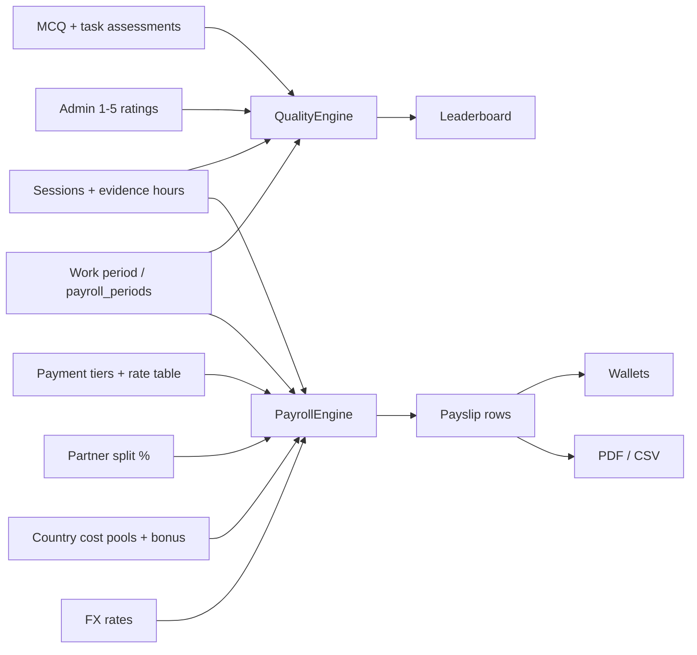

**Document:** Quality scoring and finance (work periods, payroll, wallets)  
**Status:** Implementation as of the current codebase  
**Source of truth:** `backend/services/quality_engine.py`, `backend/services/payroll_engine.py`  
**Related:** [data-models.md](data-models.md) (tables and ERD), [api.md](api.md) (HTTP surface)

---

## What this document covers

This is the operational logic behind two systems that share a **work period** (payroll period) but calculate independently:

1. **Quality** — how a worker is scored and ranked (assessments, admin ratings, session reliability, hour consistency).
2. **Finance** — how a work period is opened, how hours and earnings become pay, how costs and FX are applied, and how money reaches wallets.

Quality scores do **not** automatically change pay. Bonus on a payslip is always a manual admin amount. Rankings and payroll share the same period calendar so ops can rate people for a month and pay them for that month, but the two engines do not multiply each other.



---

# Part 1 — Quality

## Purpose

Every GlobalSolutions (GS) worker and every partner worker is ranked on one shared leaderboard. The composite score is a 0–100 number built from four components. Each component can contribute only its assigned points; missing data contributes **0** rather than inflating the remaining components.

Confirmed weights (in `quality_engine.WEIGHTS`):

| Component | Weight | What it measures | Time window |
| :--- | :--- | :--- | :--- |
| **Assessment** | 40% | Average of all MCQ results and all *graded* task-assessment scores | All time (not limited to the period) |
| **Admin rating** | 20% | Manual 1–5 ratings, normalized to 0–100 | **All** payroll periods (one score per period, then averaged) |
| **Reliability** | 25% | Share of closed sessions that ended `completed` | Current view window only |
| **Consistency** | 15% | Stability of weekly hours (low variance = higher score) | Current view window only |

A fifth display field, **session streak**, is stored but is **not** part of the composite. It is the number of consecutive calendar days (ending on the latest session day in the window) that had at least one session.

## Two leaderboard views

`recalculate_all()` writes a calendar-month snapshot and a snapshot for the **latest** payroll period. Recalculating a named period (`POST /quality/recalculate?payroll_period_id=`) replaces **only that period’s rows**, so March 2026 stays available after April is created.

| `period_type` | Window | `period_label` | `payroll_period_id` |
| :--- | :--- | :--- | :--- |
| `calendar` | First–last day of the current calendar month | e.g. `August 2026` | null |
| `payroll` | Start/end of a specific payroll period | That period’s unique `label` | That period’s id |

If there is no payroll period yet, the payroll view falls back to the same calendar month.

The admin Quality page loads `/leaderboard?period=payroll`. An **All** filter uses the latest period; a named month (e.g. `March 2026`) passes `payroll_period_id`. The page itself is a compact worker list (score + period rating + eye). The eye opens a detail modal with component point slices and an editable 1–5 rating for that period. Workers see the latest payroll board. GS and partner workers sit on the **same** board.

Recalculation is triggered by `POST /quality/recalculate` (admin). Firestore is then mirrored every 5 minutes by `leaderboard_sync`.

## Component formulas

All money-like decimals in quality are quantized to 2 decimal places with `ROUND_HALF_UP`.

### 1. Assessment (40%)

```
assessment = average( all McqResult.score_pct for worker
                    + all TaskAssessmentResult.score_pct that are not null )
```

- MCQ score = `correct answers / question count × 100`. Pass/fail against `passing_score_pct` is stored on the result but **does not** change the composite — failed attempts still average in.
- Task assessments only count once an admin has graded them (`score_pct` set). Ungraded submissions are ignored.
- There is **no date filter**. Old assessments stay in the average forever.

If the worker has no MCQ results and no graded tasks, this component is `None` and is dropped from the weighted mix.

### 2. Admin rating (20%)

Default indicator (auto-created on first use):

| Field | Value |
| :--- | :--- |
| `code` | `admin_overall` |
| Name | Admin Overall Rating |
| Scale | 1–5 |
| `weight_in_subjective_pool` | 100.00 |
| `input_mode` | `manual` |

**Collection rules**

- Admins post `POST /quality/ratings`. Score must sit between the indicator’s `scale_min` and `scale_max`.
- If `payroll_period_id` is omitted, the latest payroll period is attached.
- **One overall rating per worker per indicator per period.** A second post for the same triple updates the existing row instead of inserting another.
- `GET /quality/pending-ratings` lists every **active** worker who still lacks an `admin_overall` rating for that period.

**How the component is computed**

1. Load **all** ratings for the worker (every payroll period).
2. Collapse to one rating per period (period-linked wins; legacy ratings with no period key off their own id).
3. Normalize each score: `score / indicator.scale_max × 100`.
4. Average those normalized values.

Example: ratings 4, 5, 3 on a 1–5 scale → `(80 + 100 + 60) / 3 = 80.00`.

Ops are prompted each month: `GET /quality/pending-ratings` feeds a **Pending** notification button on the Admin Quality page. Clicking it opens a dark, blurred-backdrop modal listing workers still missing an `admin_overall` rating for the selected or latest period.

### 3. Reliability (25%)

Uses sessions whose `start_time` falls inside the view window.

```
closed = sessions with close_status set
reliability = completed_count / closed_count × 100
```

`completed` is `SessionCloseEnum.completed`. `force_released`, `abandoned`, and `timed_out` all count as closed-but-not-completed, so they lower the score. Open sessions (no `close_status`) are ignored. If there are no closed sessions in the window, the component is dropped.

### 4. Consistency (15%)

Uses the same windowed sessions, summing `duration_minutes / 60` into ISO week buckets.

```
cv = population_stdev(weekly_hours) / mean(weekly_hours)
consistency = clamp(100 × (1 − cv), 0, 100)
```

Needs **at least two weeks** with hours. A perfectly flat week-to-week pattern scores 100; wild swings approach 0. Sessions without `duration_minutes` are skipped.

### Composite and ranks

```
assessment_points  = assessment_raw  × 0.40    # maximum 40 points
rating_points      = rating_raw      × 0.20    # maximum 20 points
reliability_points = reliability_raw × 0.25    # maximum 25 points
consistency_points = consistency_raw × 0.15    # maximum 15 points
composite = sum(all component points)
```

Example: a new worker has only assessment 90 and reliability 80 (no ratings, only one week of hours so consistency contributes zero):

```
composite = 90×0.40 + 0×0.20 + 80×0.25 + 0×0.15
          = 36 + 0 + 20 + 0
          = 56.00
```

Workers with **no** available components are omitted from the board entirely. An admin-only 5/5 rating normalizes to 100 but contributes `100 × 0.20 = 20.00`, never 100.

Ranking:

1. Sort by `composite` descending.
2. `global_rank` = 1-based position on that list.
3. `country_rank` = 1-based position among workers with the same `worker.country` (first time that country appears gets 1, next worker from that country gets 2, and so on).

Stored snapshot fields: `assessment_component`, `rating_component`, `reliability_component`, `consistency_component`, plus legacy aliases `mcq_component` / `subjective_component` (same numbers as assessment / rating, or `0` when missing).

## Quality data model (short)

| Table | Role |
| :--- | :--- |
| `quality_indicators` | Named scales (currently one live default: `admin_overall`) |
| `quality_indicator_ratings` | One admin score, optional `session_id`, usually tied to `payroll_period_id` |
| `quality_composite_scores` | Recalculated snapshot per worker per `period_type`, and per `payroll_period_id` for payroll views |
| `mcq_results` | Auto-graded quiz percentages |
| `task_assessment_results` | Admin-graded practical percentages |

## Quality API (behaviour, not the full catalog)

| Action | Who | Effect |
| :--- | :--- | :--- |
| `GET /quality/me` | Worker | Latest composite row for that worker |
| `GET /quality/ratings` | Worker sees own; admin can filter | Raw rating rows |
| `POST /quality/ratings` | Admin | Create or upsert period rating |
| `GET /quality/pending-ratings` | Admin | Active workers still unrated this period (optional `payroll_period_id`) |
| `POST /quality/recalculate` | Admin | Rebuild calendar + latest payroll, or one named period if `payroll_period_id` is set |
| `GET /leaderboard?period=calendar\|payroll&payroll_period_id=` | Any logged-in user | Ranked join of scores + worker names |

---

# Part 2 — Finance

Finance is period-based. The UI calls a period a **work period** or **working month**. The database table is `payroll_periods`. Creating one on the Calendar page (`NewWorkPeriodModal`) or the Payroll page is the same API: `POST /payroll/periods`.

## Work period (payroll period)

A period is a closed date window plus a **reporting (base) currency**.

| Field | Meaning |
| :--- | :--- |
| `label` | Automatic name from `start_date`, always `March 2026` style, and renamable afterwards. Names are globally unique; duplicates are rejected (409) |
| `start_date` / `end_date` | Inclusive calendar dates. Default UI fills the whole selected month; custom ranges are allowed |
| `currency` | `USD` or `GBP` — the period’s **base** currency for rates, session earnings, and cost pools |
| `status` | Lifecycle (below) |
| `approved_by` | Admin who approved |
| `wallet_pushed_at` | When nets were credited to wallets |
| `paid_at` | When ops marked the cycle paid |
| `export_generated_at` | Last bulk payslip zip |

### Default dates

The create-period UI:

1. Picks a year-month (`YYYY-MM`).
2. Sets `start_date` to the 1st of that month and `end_date` to the last day.
3. Sets `label` automatically to `Month Year` from `start_date` (not editable at create time). Duplicate month names are rejected.
4. Lets the operator override dates without changing the generated name (the name still follows the **start** month).

Nothing in the engine requires a period to be a calendar month. Overlapping date ranges are not blocked at the database layer, but **labels are unique**, so two periods cannot both be named `March 2026`.

### Renaming a period

A month sometimes needs two periods (a regular run plus a correction or bonus run), and the generated name can only be used once. A pencil next to the period name on the Finance action bar and on the Calendar navigator renames it through `PATCH /payroll/periods/{id}` with `{ "label": "June 2026 (bonus run)" }`.

- The name is trimmed; empty names are rejected (400).
- A name already used by another period is rejected (409), enforced by `uq_payroll_periods_label`.
- Renaming does not touch dates, currency, status, or any calculated figure. Quality snapshots keyed to `payroll_period_id` follow the period, not its name.

### Lifecycle

```
open → calculated → approved → paid
         ↑              │
         └──── reopen ──┘   (paid cannot be reopened)
```

| Status | What is true | Allowed actions |
| :--- | :--- | :--- |
| **open** | Period exists; no finished calc (or it was reopened) | Edit cost pools; seed/calculate; edit ledger |
| **calculated** | Line items + worker summaries exist | Recalculate; edit summaries/costs; approve; reopen |
| **approved** | FX on summaries frozen as of approval (“pay day”) | Push wallets; mark paid; reopen (clears `approved_by`) |
| **paid** | Terminal. `paid_at` set | Downloads only. Cannot reopen, recalculate, or edit summaries |

Engine guards:

- `calculate_period` refuses `approved` and `paid` (“reopen it before recalculating”).
- `approve_period` requires `calculated`.
- `push_period_to_wallets` requires `approved` or `paid`.
- `mark-paid` requires `approved`.
- Bulk ledger upserts refuse `paid`.

Reopen sets status back to `open` and clears `approved_by`. It does **not** delete line items or summaries.

## What a session must look like to be paid

Sessions are the raw input. Three types exist:

| `session_type` | Typical work | How pay is derived |
| :--- | :--- | :--- |
| `gs_rdp` | Work on a GS RDP machine | **Hours × hourly rate** |
| `partner_multilog` | Partner-owned / multilog client | **Reported earnings × partner arrangement split** |
| `third_party_platform` | Handshake, Outlier, Prolific, etc. | **Reported earnings** (100% to the worker unless a partner arrangement applies) |

### Inclusion filter used by `calculate_period`

A closed session is included when **all** of these hold:

1. `end_time` is set (the session is finished)
2. `start_time` is on or after `period.start_date 00:00 UTC`
3. `start_time` is on or before `period.end_date 23:59:59 UTC`
4. `payroll_approval_state` is **not** `flagged` or `excluded`
5. `payroll_period_id` is empty or already this period (a session billed to another period is not stolen)

On seed/recalculate the engine stamps `payroll_period_id` and promotes `pending` → `approved`, so the session row stays linked to the finance period in the database.

Workers **cannot** change `payroll_approval_state`, `payroll_period_id`, or `admin_notes`. Admins can still flag or exclude a session and recalculate. States: `pending | approved | flagged | excluded`.

`close_status` is **not** part of the payroll filter. Quality reliability *does* care about close status; payroll does not.

### Hours (duration)

`duration_minutes` is the number payroll uses, in this order: on-image times, stored duration, then clock `start_time`/`end_time`. Per worker, those minutes are summed for the period. GS pay is **hours × hourly rate** (set the rate; base pay updates automatically). Evidence can fill duration:

- Worker uploads start and end screenshots and the times shown on those images (`image_start_at`, `image_end_at`).
- `apply_image_duration` sets `duration_minutes = floor((image_end_at − image_start_at) in minutes)`, floored at 0.
- Evidence is “complete” only when both image URLs **and** both image times exist. Incomplete closed sessions trigger a worker notification.

**Hours on finance** (`evidence_hours_for_worker`) sum every closed session in the period (skipping flagged/excluded). That total is stored on `payroll_worker_summaries.hours_logged` and is not typed by the admin. Entering a rate computes **base pay = hours × rate**. When a worker updates start/end times, the covering open/calculated period is stamped on `sessions.payroll_period_id` and hours (and pay) refresh automatically.

### Partner / third-party earnings

For non-`gs_rdp` sessions, gross comes from JSON:

```
type_specific_fields.earnings_amount
```

Missing or zero earnings skip the line item and raise exception flag `session_missing_earnings`.

## Payment rates (how a worker’s hourly rate is chosen)

Pay is **not** read from `payment_tiers` at calculate time. Tiers sync into `rate_table_entries`, and the engine reads the rate table.

### Payment tiers (catalog)

Table `payment_tiers`: named catalog (`Junior`, `Standard`, …) with `rate`, `currency`, `unit`.

Units and hourly conversion (`hourly_equivalent`):

| Unit | Hourly equivalent |
| :--- | :--- |
| `per_hour` | rate as-is |
| `per_day` | rate / 8 |
| `per_week` | rate / 40 |
| `per_month` | rate / 160 |
| `per_task` | stored as-is (GS hour path still needs a number) |

Creating or updating an **active** tier upserts an open-ended **tier-level** `rate_table_entries` row (`worker_id` null, `pay_tier` = tier name, `rate_type` = hourly, amount = hourly equivalent). Previous open rows are closed with `effective_to = today`.

Assigning a tier (`POST /payment-tiers/{id}/assign`) only writes `workers.pay_tier = tier.name`. It does not create a worker-specific rate row.

### Rate table lookup (`_hourly_rate_for`)

For worker W and period P, pick the latest `RateTableEntry` with `effective_from <= P.end_date`, in this order:

1. **Worker-specific** row (`worker_id = W.id`) — wins even if a tier row exists.
2. Else **tier-level** row (`worker_id` null and `pay_tier = W.pay_tier`).
3. Discard the row if `effective_to` is set and `effective_to < P.start_date`.

If nothing matches, GS RDP hours produce flag `no_rate` and contribute `0` base pay.

Worker-facing `/payroll/my-overview` shows the current period (today inside start/end, else the latest unpaid period) plus this resolved rate.

## Calculate: line items then payslip rows

`POST /payroll/periods/{id}/calculate` (UI: “Seed from sessions” / “Recalculate”).

It **deletes all existing `payroll_line_items` for the period**, then rebuilds. Summaries are updated in place so **manual bonuses survive**. Rows with `admin_locked = true` keep admin-edited hours/rate/costs/FX (see sticky ledger below).

### Pass 1 — per worker, per session

Hours logged (for the summary, all included session types):

```
hours = sum(duration_minutes of included sessions) / 60
```

**GS RDP sessions**

```
gross = (duration_minutes / 60) × hourly_rate
worker_pct = 100, gs_pct = 0, partner_pct = 0
worker_net = gross
```

That gross is added into the worker’s **base pay**. A line item is written only if a rate exists and duration is set.

**Partner multilog + third-party**

```
earnings = earnings_amount
```

Split:

- If session is `partner_multilog` **and** worker is `partner_worker` **and** `partner_entity_id` is set: load the latest `PartnerArrangement` for that entity with `effective_from <= period.end_date`. Use `worker_pct / gs_pct / partner_pct` (DB check: they must sum to 100.00). Missing arrangement → flag `no_partner_arrangement` and treat as 100% worker.
- Otherwise: 100% worker.

```
worker_net  = round(earnings × worker_pct / 100)
gs_net      = round(earnings × gs_pct / 100)
partner_net = earnings − worker_net − gs_net   # remainder so cents still sum
base_pay   += worker_net
```

`PartnerClientOverride` exists on the partner model but is **not** applied in `payroll_engine` today. Splits are arrangement-level only.

If `hours == 0`, flag `no_hours`.

### Pass 2 — country cost pools, FX, payslip math

Country pools (`country_cost_pools`) are optional per period per country:

- `transfer_cost_total` — remittance / payout rails
- `external_cost_total` — other allocated business cost

Allocation is **proportional to that worker’s hours among workers in the same country who were in this calculation**:

```
share = worker_hours / country_hours
transfer_cost_base = pool.transfer_cost_total × share
external_cost_base = pool.external_cost_total × share
```

Pools and session money are in the **period base currency**. Summaries are stored in the worker’s **local** currency:

```
local_currency = countries[worker.country].currency_code  (else period.currency)
fx_rate = latest FX: 1 period.currency = X local   (manual rates beat API rates)
rate_local        = hourly_rate × fx
base_pay_local    = base_pay_base × fx
transfer_cost     = transfer_cost_base × fx
external_cost     = external_cost_base × fx
```

If no FX row exists, flag `no_fx_rate`, keep amounts in the period currency, and store `fx_rate` as null.

**Bonus is never calculated.** It is whatever was already on the summary (default 0). Admins type it in local currency.

Payslip identities (all local unless noted):

```
gross_earned     = base_pay + bonus
total_deductions = transfer_cost + external_cost
final_net        = gross_earned − total_deductions
base_equivalent  = final_net / fx_rate     # back into period currency
```

If `final_net < 0`, flag `negative_net`.

If a country pool exists, pool-derived costs overwrite previous costs. If **no** pool exists, a previous summary’s manual `transfer_cost` / `external_cost` are kept.

Workers who disappear from the calc (no approved sessions this run) have their summary deleted **unless** `bonus != 0` (bonus-only rows are kept).

Period status becomes `calculated`.

### Exception flags (reference)

| Flag | Meaning |
| :--- | :--- |
| `no_rate` | GS hours exist but no applicable rate-table row |
| `session_missing_earnings` | Partner/third-party session with no/zero `earnings_amount` |
| `no_partner_arrangement` | Partner multilog worker has no arrangement covering the period |
| `no_hours` | Included sessions sum to 0 hours |
| `no_fx_rate` | Could not convert period currency → worker local currency |
| `negative_net` | Deductions exceeded gross |

## The Finance worker list

The Finance page (`/admin/payroll`) is a per-worker list for the selected work period, the same shape as the Quality page. It loads `GET /payroll/periods/{id}/ledger`, which returns **every active worker** whether or not they have a payslip row yet, so someone with no approved sessions still appears and can still be paid.

Each line shows Hours, Rate/hr, Base Pay, Bonus, Gross, Deductions, Final Net, pay currency and exception flags. Workers with no payslip row yet show their evidence hours instead and an invitation to open the eye.

Controls above the list:

| Control | Effect |
| :--- | :--- |
| `All` / `GS only` / `Partners only` | Filters on `worker_type`; `partner_worker` is a partner, `gs_registered` is GS. Both groups use the same payment flow |
| Search | Matches name, country, or pay tier |
| Row checkboxes | Build an ad-hoc set for **Apply to many** |
| Eye | Opens that worker's full payslip detail |

### Eye: one worker's payslip

`WorkerPayModal` shows the exact payslip row-set that the PDF prints — Hours Logged, Rate per Hour, Base Pay, Bonus, Gross Earned, Transfer Cost Deduction, External Cost Deduction, Total Deductions, Final Net Pay Due — with the editable lines as inputs and the derived lines recomputing as you type (the same arithmetic as `recompute_summary`). It also carries the **pay currency dropdown** and the FX field, and can download that worker's payslip PDF.

Saving posts a single-row `POST .../summaries/bulk` with `upsert: true`, so it works before **Calculate** has ever run. The modal is read-only once the period is `approved` or `paid`.

### Apply to many

Fill a value once and push it to a group. The panel holds Hours, Rate/hr, Bonus, Transfer cost, External cost, FX and Currency, plus an audience picker: `All workers`, `GS only`, `Partners only`, or `Selected`. Each option shows its live count, and applying asks for confirmation naming the fields and the audience.

Two rules matter:

- **Blank fields are not sent.** Only the fields you typed go into the request, so pushing a bonus to every partner leaves their hours, rates and costs alone. The server ignores `None` values on each bulk item.
- **A currency switch wins over a typed FX.** Choosing a currency disables the FX input, because the server re-resolves the rate for the new currency.

This replaces the old spreadsheet-only workflow for common cases; `PeriodLedgerModal` ("Open ledger") is still there for wide row-by-row editing.

### Pay currency per worker

`local_currency` on a payslip row defaults to the worker's country currency (`countries.currency_code`) but is now editable per row through the dropdown, and settable in bulk. When the currency changes and no explicit FX was supplied, the server re-resolves `1 period.currency = x new_currency` from the rate table.

That re-resolution is not optional. `recompute_summary` keeps a locked row's stored `fx_rate`, and every admin edit locks the row, so a currency change must replace the rate or the row would keep converting at the old currency's number. If no rate exists for the new currency, `fx_rate` becomes null and the row picks up the `no_fx_rate` flag.

## Sticky admin ledger

The Calendar/Payroll **ledger** (`GET /payroll/periods/{id}/ledger`) lists every **active** worker, suggested evidence hours, and the summary if any. Admins can type hours, rate, bonus, costs, and FX, then bulk-save (`POST .../summaries/bulk`).

Saving a row:

1. Upserts `payroll_worker_summaries`.
2. Sets `admin_locked = true` unless the payload explicitly sets it false.
3. Recomputes derived fields via `recompute_summary`:

```
base_pay         = hours_logged × rate_per_hour     # using the edited local figures
gross_earned     = base_pay + bonus
total_deductions = transfer_cost + external_cost
final_net        = gross_earned − total_deductions
base_equivalent  = final_net / fx
```

On a later **Calculate**, locked rows are **not** overwritten (hours, rate, costs, FX stay). Bonus is always preserved. Exception flags from the session pass are merged onto the locked row.

This is how ops can pay a worker who has incomplete evidence or no approved sessions: enter hours/rate on the ledger, lock, then still run calculate for everyone else.

If the period was still `open`, a successful bulk save moves it to `calculated`.

## Approve, wallets, paid

### Approve (`POST .../approve`)

Requires `calculated`. For each summary, unless the row is locked with a positive `fx_rate`, FX is refreshed from the rate table **as of approval** (“pay day freeze”). Status → `approved`.

### Push to wallets (`POST .../push-wallets`)

Requires `approved` (or already `paid`). For each summary with `final_net > 0`:

1. Skip if a `wallet_transactions` row already exists for this worker + period with `tx_type = payroll_credit` (partial unique index). Push is **idempotent**.
2. Create the worker’s `wallets` row if needed (currency = summary local currency).
3. Insert a `payroll_credit` transaction for `final_net`.
4. `wallet.balance += final_net`.
5. Notify the worker (`category = payment`).

Zero or negative nets are skipped (counted in `skipped`). Sets `wallet_pushed_at`. Does **not** change status to paid.

Wallet transaction types:

| `tx_type` | When |
| :--- | :--- |
| `payroll_credit` | Period push (one per worker per period) |
| `adjustment` | Admin manual **credit** (`POST /wallets/adjustments`, amount > 0, note required) |
| `payout` | Admin manual **debit** (amount < 0 on the same endpoint) — used when money leaves the wallet |

### Mark paid (`POST .../mark-paid`)

Requires `approved`. Sets `status = paid` and `paid_at = now`. After this the period is frozen.

## FX

Everything is quoted **against USD**, in the direction `1 USD = x local`. Conversion runs one way only: from a period's base currency (USD or GBP) into a worker's payout currency, never back.

### The currency catalog

`currencies` is the admin-managed list of payout currencies: `code`, `name`, optional `symbol`, `is_active`. It is independent of `countries`, so a currency can exist before any worker lives in a country that uses it.

The Currencies page (`/admin/currencies`) shows one row per currency with an inline-editable `1 USD =` field. Saving it writes a **manual** `fx_rates` row for today, which beats any API row. GBP is just another row in this table, so `1 USD = 0.74 GBP` is the single GBP number anyone maintains.

| Endpoint | Effect |
| :--- | :--- |
| `GET /currencies/list` | Catalog with each currency's effective USD rate, that rate's source, and the derived GBP rate. `?active_only=true` for dropdowns |
| `POST /currencies/list` | Add a currency; an optional `usd_rate` seeds today's manual rate |
| `PATCH /currencies/list/{id}` | Rename, deactivate, or repoint `usd_rate`. USD itself is rejected — its rate is always 1 |

### Rate resolution

`services/fx.py`:

- `resolve_rate(base, quote)` returns the rate **and** where it came from: `identity`, `manual`, `api`, or `derived`. `get_rate` is the thin wrapper that returns just the rate.
- Order: identity if the codes match; else the latest `fx_rates` row for the pair, **manual before API**.
- **GBP falls back to a cross rate.** With no stored `GBP → quote` row, the rate is derived as `(1 USD = quote) / (1 USD = GBP)`. Keeping USD rates current is therefore enough to keep GBP payouts correct.
- `fetch_api_rates` pulls quotes for every catalog currency and every country currency; it never overwrites manual rows.

The API behind "Refresh from API" is `FX_API_URL`, which defaults to `https://open.er-api.com/v6/latest`. It is free, needs no key, and covers the currencies in use. `fetch_api_rates` calls it once per base currency and stores the results with `source = "api"`.

Country → local currency is `countries.currency_code` (default USD). It is the default for a new payslip row; admins can override the currency per row afterwards.

## Client revenue (after worker pay)

`GET /payroll/periods/{id}/reports/revenue-share` is **not** worker pay. It answers “after we paid workers, how do GS and the account owner split what is left?”

Per client (sessions’ `client_id`; missing → `Unattributed`):

```
earnings     = sum of line-item gross_amount
worker_cost  = that client’s worker_net
             + a share of the worker’s period deductions
               (deductions converted back to base, then × this line’s gross / worker’s total gross)
distributable = earnings − worker_cost
gs_share      = distributable × agreement.gs_pct / 100
owner_share   = distributable − gs_share
```

Agreement is the latest `ClientRevenueAgreement` with `effective_from <= period.end_date`. `gs_pct + owner_pct = 100`. No agreement → 100% GS.

Confirmed order: **earnings − worker costs first**, then GS/owner split. Worker payroll is never a residual of client revenue.

## Payslips, exports, worker view

Payslip PDF (`payslip_pdf.py`) is one row-set per worker:

| Line | Meaning printed on the PDF |
| :--- | :--- |
| Hours Logged | Approved hours in the selected month |
| Rate per Hour | Contract rate per approved hour (local) |
| Base Pay | Hours × rate |
| Bonus | Any approved monthly bonus |
| Gross Earned | Base + bonus |
| Transfer Cost Deduction | Allocated remittance / platform cost |
| External Cost Deduction | Allocated external business cost |
| Total Deductions | Transfer + external |
| Final Net Pay Due | Amount payable |

Each money line also shows the period-currency equivalent using the frozen `fx_rate`.

Workers see:

- Wallet balance and transactions (`/wallets/me`)
- Current period, pay tier, and rate (`/payroll/my-overview`)
- Payslip history (`/payroll/my-summaries`)

The wallet Payslip History tab is a card per payslip carrying exactly the PDF lines above, plus the period-currency equivalent. Because a month can hold more than one work period, the tab has a period filter: `All periods` plus one chip per period name.

`/payroll/my-summaries` returns **approved** and **paid** periods. With `?include_pending=true` — which the wallet page uses — it also returns `calculated` periods, so a worker can see the month as soon as finance has worked it out. Those cards carry a **Not final** badge, and each row reports its `period_status`.

Each expanded payslip card has a **Download PDF** button hitting `GET /payroll/my-summaries/{summary_id}/payslip.pdf`. That route is deliberately separate from the admin one: it resolves the caller's own worker row and 404s if the summary belongs to anyone else, so a guessed id leaks nothing. It refuses periods still `open`, matching what `/my-summaries` publishes.

Admins can download one PDF, a zip of all PDFs (sets `export_generated_at`), or a payroll CSV.

## Emailing payslips at scale

Sends are **queued, never inline**. `POST /communications/payslips/send` validates the audience, writes one `email_jobs` row plus one `email_job_items` row per recipient, and returns `202` with a `job_id`. A background loop (`services/email_dispatch.py`, started from the app lifespan) drains the queue. This is what lets a 1000-worker run finish: the HTTP request does bounded work, and a restart mid-send resumes from whatever is still `pending` instead of losing progress or double-sending.

**HTML first.** The default payslip email is a styled HTML message carrying the same lines as the PDF, a hero net-pay figure, and a *View in your wallet* button built from `APP_BASE_URL`. A plain-text alternative is always attached, which matters for deliverability on bulk sends. The PDF is not attached by default because workers can download it from the wallet at any time.

Two send modes, chosen by `attach_pdf`:

| Mode | Endpoint used | Throughput | When |
| :--- | :--- | :--- | :--- |
| HTML only (default) | Resend `/emails/batch` | 100 recipients per API call | Normal monthly run |
| PDF attached | Resend `/emails` | 1 recipient per API call | Only when the attachment is contractually needed |

Resend's batch endpoint rejects attachments, which is the whole reason for the split. The receipts page warns that ticking *Attach PDF* moves the job onto the slow path.

Dispatcher behaviour:

- **Claiming.** Each tick claims up to `EMAIL_DISPATCH_CLAIM_SIZE` (100) pending items with `FOR UPDATE SKIP LOCKED`, so several Gunicorn workers can drain one queue without overlapping.
- **Retries.** A failed item goes back to `pending` until `EMAIL_DISPATCH_MAX_ATTEMPTS` (3) is spent, then sticks at `failed`. A `429` from Resend is retried inside the call using the `Retry-After` header, then exponential backoff.
- **Idempotency.** Every batch chunk and every single send carries an `Idempotency-Key`, so a retry after a lost response cannot double-send.
- **Crash recovery.** Items stuck in `claimed` for longer than `EMAIL_DISPATCH_STUCK_MINUTES` (10) are reaped back to `pending`, or failed if out of attempts.
- **Business-level skipping.** Workers already emailed for a period (a `sent` payslip row in `email_log`) are skipped unless `force_resend` is set, so re-running after fixing a few rows does not spam everyone.

Queueing a payslip job also raises an in-app `payment` notification per worker, so the wallet surfaces the payslip even if the email is delayed or filtered.

Job control endpoints (all admin):

| Action | Effect |
| :--- | :--- |
| `GET /communications/jobs` | Recent jobs with live tallies (drives the *Recent sends* chips) |
| `GET /communications/jobs/{id}` | One job; `?include_items=true` for per-recipient rows |
| `POST /communications/jobs/{id}/retry` | Re-queues only the `failed` items; sent recipients are untouched |
| `POST /communications/jobs/{id}/cancel` | Marks outstanding items `skipped`; already-sent stay sent |

The receipts page polls the job every 2s while it is `queued`/`running` and stops once it settles, showing a progress bar, per-status tallies, a **Retry failed** button, and a **Cancel** button. Announcements run on the same tables and the same dispatcher, with the message body stored on `email_jobs.body` so it survives a restart.

### Announcement audience

`POST /communications/broadcast` sends one identical message. The audience is either workers filtered by `countries` / `worker_type` / `active_only`, or typed addresses only (`skip_workers: true`). `extra_emails` accepts many addresses and is additive in both modes, so finance or an ops inbox can be copied on a real send. Every typed address is validated against the same rules as a worker address, and a rejected one fails the request with a message naming it rather than being silently dropped.

## Email history

`email_log` is the permanent record: one row per recipient per send attempt, written by all three paths (queued payslips, queued announcements, inline notification emails). The **Email History** page (`/admin/payroll/receipts/history`) is the audit surface over it.

It keeps two facts apart, because operators conflate them constantly:

| Column shown | Question it answers |
| :--- | :--- |
| **Accepted** (`status`) | Did the message leave the platform — did Resend take it? |
| **Delivery** (`last_event`) | What happened next: delivered, opened, clicked, delayed, bounced, marked as spam |

A row can be *Accepted: yes* and *Delivery: bounced*. A row that is delivered can still be sitting in the recipient's Spam or Promotions folder — delivery confirms the receiving server accepted it, nothing more, and the page says so.

Provider events reach the row two ways. In production the Resend webhook pushes each event to `POST /communications/resend/webhook`, which requires a valid Svix signature (`RESEND_WEBHOOK_SECRET`) and rejects everything when that secret is unset. Locally, or to backfill a missed webhook, **Sync delivery status** calls `POST /communications/log/sync`, which asks the provider about messages whose outcome is still unknown; the eye-modal's **Re-check** does the same for one row. Events are rank-ordered so a late or duplicate event can never move a row backwards from `delivered` to `sent`.

The page filters on recipient/subject search, type, delivery state (including *Awaiting confirmation* and *Bounced or spam*), accepted/rejected, work period and a date range, and pages 50 at a time. Its counters are computed over the whole filtered set rather than the visible page. The eye opens one email in full: sending identity, provider message id, the work period and worker behind it, the bulk send it came from with that job's tallies and attempt count, and the complete event timeline with bounce reasons and clicked links.

Rows sent before this trace existed, and any row Resend never issued an id for, show **Sent** with no delivery state; the modal says the provider id was not recorded rather than implying delivery.

## Finance data model (short)

| Table | Role |
| :--- | :--- |
| `payroll_periods` | Work period window, base currency, lifecycle timestamps |
| `payroll_line_items` | One row per included session: gross, split %, nets, flags. Check: splits sum to 100.00 |
| `payroll_worker_summaries` | One payslip row per worker per period (unique). Local amounts + FX snapshot + `admin_locked` |
| `country_cost_pools` | Per-country transfer/external totals for a period |
| `payment_tiers` | Named catalog of rates |
| `rate_table_entries` | Dated worker- or tier-level hourly amounts actually used in calc |
| `partner_arrangements` | Worker / GS / partner % (must sum 100) |
| `client_revenue_agreements` | GS / owner % **after** worker costs |
| `wallets` / `wallet_transactions` | Running balance; idempotent payroll credits |
| `currencies` | Payout currency catalog (`code`, `name`, `symbol`, `is_active`) behind every currency dropdown |
| `fx_rates` / `countries` | Manual-over-API FX quoted against USD; country → default local currency |
| `sessions` | Hours, evidence, `earnings_amount`, `payroll_approval_state` |
| `email_jobs` / `email_job_items` | Queued bulk sends and their per-recipient state (payslips and announcements) |
| `email_log` | Permanent email history: our accept/reject outcome plus the provider's delivery events |

## Admin workflow (practical order)

1. **Open a work period** on Calendar or Payroll (month or custom dates, USD or GBP). Rename it with the pencil if the month already has one.
2. Workers log sessions; complete start/end evidence so duration is trustworthy.
3. **Seed from sessions** on Finance. Closed sessions in the period dates are linked (`payroll_period_id`) and hours are summed per worker. Flag or exclude a session before seeding if it should not pay.
4. Maintain **payment tiers** and assign `pay_tier` on workers; override individuals in the rate table if needed. Entering a rate (for example 5 USD/hr) auto-calculates base pay as hours × rate.
5. Check the **Currencies** page: every payout currency present and its `1 USD =` rate current.
6. Optionally set **country cost pools**.
7. **Rate quality** for the period (`admin_overall` 1–5). This is for the leaderboard, not pay.
8. Work the **Finance list**: eye for one worker, **Apply to many** for a shared bonus or rate, ledger for wide edits. Any save locks those rows.
9. Recalculate if session data changed; locked rows keep admin figures.
10. **Approve** (freeze FX).
11. **Push to wallets**.
12. Export payslips / CSV, and **queue the payslip emails** on the Receipts page. The send runs in the background — watch the progress bar, then use **Retry failed** for any bounces.
13. **Mark paid**.

To remove a work period entirely, open the pencil next to its name (Calendar or Finance) and choose **Delete this work period**. Confirm, then enter the 6-digit code emailed to the admin alert inbox (Settings). Codes expire in 3 minutes. Changing that inbox does not let the new address receive codes for 24 hours.

---

# How quality and finance touch (and how they do not)

| Shared concept | Quality | Finance |
| :--- | :--- | :--- |
| Work period dates | Payroll view uses the selected (or latest) period window for reliability/consistency; ratings averaged across **all** periods | Period is the payment batch |
| Sessions | Close status and weekly hours in the window | Only **approved** sessions; hours × rate or earnings × split |
| Admin action at period end | 1–5 overall rating per worker | Cost evaluation, bonus, approve, pay |
| Bonus / rank | Rank is the composite score | Bonus is a typed amount; **not** derived from rank |
| Partner vs GS | Same leaderboard | Different pay path (hours vs earnings split) |

If product later wants “top quartile gets a bonus”, that rule does not exist in the engines today — it would be a new step that reads `quality_composite_scores` into `payroll_worker_summaries.bonus`.

---

# Worked examples

## Quality

Worker in August payroll view:

- MCQ 80, 90 and graded task 70 → assessment = `(80+90+70)/3 = 80.00`
- Ratings across all periods: 4/5 and 5/5 → rating = `(80+100)/2 = 90.00`
- 9 completed, 1 abandoned → reliability = `90.00`
- Weekly hours 20, 22, 18 → low CV → consistency ≈ `91.xx`

```
composite = 80×0.40 + 90×0.20 + 90×0.25 + 91×0.15
          = 32 + 18 + 22.5 + 13.65
          = 86.15
```

## Finance — GS worker

Period August 2026, currency USD. Worker in Kenya (KES). Hourly rate USD 3.00. FX: 1 USD = 129.00 KES. Approved GS RDP: 40 hours. Country transfer pool for Kenya USD 100; this worker is 40 of 80 country hours → USD 50 transfer. Bonus KES 0.

```
base_pay_usd     = 40 × 3.00 = 120.00
base_pay_kes     = 120 × 129 = 15,480.00
rate_kes         = 3 × 129   = 387.00
transfer_kes     = 50 × 129  = 6,450.00
gross            = 15,480
deductions       = 6,450
final_net_kes    = 9,030.00
base_equivalent  = 9,030 / 129 = 70.00 USD
```

Wallet credit on push: **9,030.00 KES**.

## Finance — partner worker

Same period. Partner arrangement 50 / 20 / 30 (worker / GS / partner). One approved multilog session with `earnings_amount = 200` USD, 10 hours. No GS RDP.

```
worker_net = 200 × 50% = 100.00 USD  → this is base_pay
gs_net     = 40.00
partner_net= 60.00
hours_logged = 10
```

Then convert 100 USD (and any allocated costs) into local currency the same way as above. Hourly rate is unused for this earnings path but still stored on the summary from the rate table for display.

---

# Code map

| Concern | Primary files |
| :--- | :--- |
| Quality math | `backend/services/quality_engine.py` |
| Quality HTTP | `backend/routers/quality.py`, `backend/routers/leaderboard.py` |
| Quality tables | `backend/models/quality.py` |
| Payroll math | `backend/services/payroll_engine.py` |
| Payroll HTTP | `backend/routers/payroll.py` |
| Tiers → rate table | `backend/routers/payment_tiers.py`, `backend/models/payment_tier.py` |
| Wallets | `backend/routers/wallets.py`, `backend/models/wallet.py` |
| FX and rate resolution | `backend/services/fx.py` |
| Currency catalog | `backend/models/currency.py`, `backend/routers/currencies.py` |
| Session evidence hours | `backend/services/session_evidence.py` |
| Payslip PDF | `backend/services/payslip_pdf.py` |
| Email templates and Resend calls | `backend/services/email_resend.py` |
| Bulk email dispatcher | `backend/services/email_dispatch.py` |
| Email job queue HTTP | `backend/routers/communications.py` |
| Email job tables | `backend/models/email_job.py` |
| Admin work periods | `frontend/app/admin/calendar/page.tsx`, `frontend/components/payroll/NewWorkPeriodModal.tsx` |
| Period rename pencil | `frontend/components/payroll/PeriodNameEditor.tsx` |
| Admin finance list | `frontend/app/admin/payroll/page.tsx` |
| Payslip detail (eye) | `frontend/components/admin/WorkerPayModal.tsx` |
| Apply to many | `frontend/components/admin/ApplyToManyPanel.tsx` |
| Spreadsheet ledger | `frontend/components/admin/PeriodLedgerModal.tsx` |
| Currency dropdown data | `frontend/lib/currencies.ts` |
| Admin currencies / FX page | `frontend/app/admin/currencies/page.tsx` |
| Admin quality / ratings | `frontend/app/admin/quality/page.tsx` |
| Payslip email / broadcast page | `frontend/app/admin/payroll/receipts/page.tsx` |
| Email job progress UI | `frontend/components/admin/EmailJobProgress.tsx` |
| Worker wallet | `frontend/app/worker/(shell)/wallet/page.tsx` |
