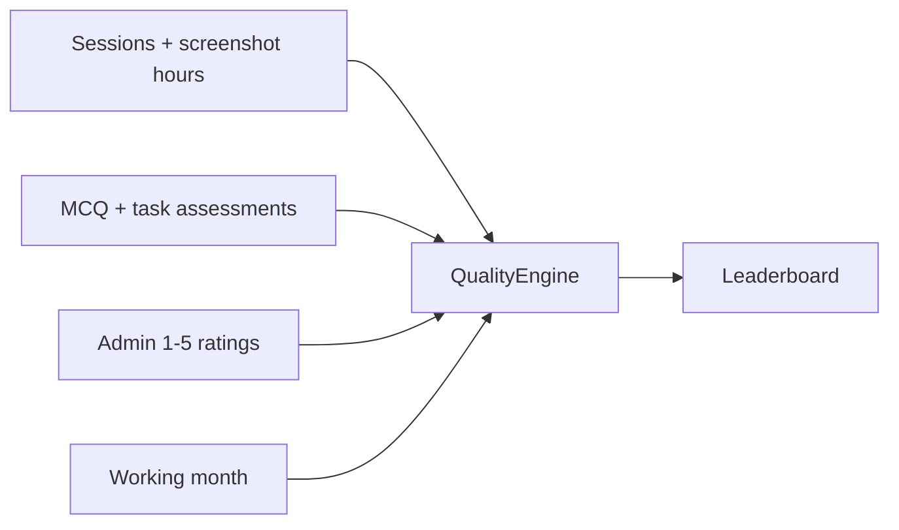

**Document:** Quality scoring and the leaderboard  
**Status:** Implementation as of the current codebase  
**Source of truth:** `backend/services/quality_engine.py`  
**Related:** [financial.md](financial.md) (all money and pay logic), [data-models.md](data-models.md) (tables and ERD), [api.md](api.md) (HTTP surface)

---

## What this document covers

How a worker is scored and ranked: assessments, admin ratings, session finish-rate, and hours/days/weeks present.

Quality shares the **working month** calendar with finance, so ops can rate people for a month and pay them for that month. The two calculate independently: a quality score never changes pay, and a payslip bonus is always a manual admin amount. Everything about pay, currencies and wallets lives in [financial.md](financial.md).



---

## Purpose

Every GlobalSolutions (GS) worker and every partner worker is ranked on one shared leaderboard. The composite score is a 0–100 number built from four components. Each component can contribute only its assigned points; missing data contributes **0** rather than inflating the remaining components.

Confirmed weights (in `quality_engine.WEIGHTS`):

| Component | Weight | What it measures | Time window |
| :--- | :--- | :--- | :--- |
| **Assessment** | 40% | Average of the **current** score on each named test (MCQ and graded task). A retake **overwrites** that test’s row. | Tests whose current completion/grade date falls in the view window; **All periods** averages every current test |
| **Admin rating** | 20% | Manual 1–5 ratings, normalized to 0–100 | **All** payroll periods (one score per period, then averaged) |
| **Reliability** | 15% | Did they **finish** closed sessions (`completed` vs abandoned / timed out / force released) | Current view window only |
| **Consistency** | 25% | Paid screenshot **hours** + unique **days** present + **weeks** with paid hours (average of three 0–100s) | Current view window only |

A fifth display field, **session streak**, is stored but is **not** part of the composite. It is the number of consecutive calendar days (ending on the latest session day in the window) that had at least one session.

## Two leaderboard views

`recalculate_all()` writes a calendar-month snapshot, a snapshot for the **latest** payroll period, and an **All periods** snapshot (`period_type=all`). Recalculating a named period (`POST /quality/recalculate?payroll_period_id=`) replaces **only that period’s rows**, so March 2026 stays available after April is created.

| `period_type` | Window | `period_label` | `payroll_period_id` |
| :--- | :--- | :--- | :--- |
| `calendar` | First–last day of the current calendar month | e.g. `August 2026` | null |
| `payroll` | Start/end of a specific payroll period | That period’s unique `label` | That period’s id |
| `all` | All sessions to date; every current test score | `All periods` | null |

If there is no payroll period yet, the payroll view falls back to the same calendar month.

The admin Quality page loads `/leaderboard?period=payroll` for a named month (`payroll_period_id`) and `/leaderboard?period=all` for **All periods**. The page itself is a compact worker list (score + period rating + eye). The eye opens a detail modal with component point slices and an editable 1–5 rating for that period. Workers see the latest payroll board. GS and partner workers sit on the **same** board.

Recalculation is triggered by `POST /quality/recalculate` (admin). The leaderboard cache is then refreshed every 5 minutes by `leaderboard_sync`.

## Component formulas

All money-like decimals in quality are quantized to 2 decimal places with `ROUND_HALF_UP`.

### 1. Assessment (40%)

Each worker has **one current score per named test**. The Scores table shows the test name and that percentage. If Test 1 was 60 and they retake it and get 89, the same row is updated to 89 — 60 is gone. Attempt limits still apply; extra rows are not stored.

Quality then **averages those current scores**. Ten tests → average of those ten percentages, then × 0.40.

```
n = number of current test scores in scope
assessment_raw = (score1 + score2 + … + scoren) / n     # e.g. (80+90+70)/3 = 80.00
assessment_points = assessment_raw × 0.40               # 32.00 of 40
```

- **Named period:** include a test if its current completion (MCQ) or grade (task) date sits in that period.
- **All periods:** include every current test score, with no date filter.
- **MCQ:** each question has `marks`; marks on a set must total **100** before it can be activated. Auto-score = sum of marks for correct answers.
- **Task:** each activity has `max_marks`; those must total **100**. Grade = sum of marks awarded.
- Training **content** is not a percentage. A quiz/task **linked** on the module is a normal test.
- Deleting an MCQ/task removes questions, activities, and media. **The current result stays**, with `title_snapshot` + `source_id`, on the Scores page.

If the worker has no current MCQ/task scores in scope, this component is `None` → 0 of 40.

### 2. Admin rating (20%)

Default indicator (auto-created on first use):

| Field | Value |
| :--- | :--- |
| `code` | `admin_overall` |
| Name | Admin Overall Rating |
| Scale | 1–5 |
| `weight_in_subjective_pool` | 100.00 |
| `input_mode` | `manual` |

**Collection rules**

- Admins post `POST /quality/ratings`. Score must sit between the indicator’s `scale_min` and `scale_max`.
- If `payroll_period_id` is omitted, the latest payroll period is attached.
- **One overall rating per worker per indicator per period.** A second post for the same triple updates the existing row instead of inserting another.
- `GET /quality/pending-ratings` lists every **active** worker who still lacks an `admin_overall` rating for that period.

**How the component is computed**

1. Load **all** ratings for the worker (every payroll period).
2. Collapse to one rating per period (period-linked wins; legacy ratings with no period key off their own id).
3. Normalize each score: `score / indicator.scale_max × 100`.
4. Average those normalized values.

Example: ratings 4, 5, 3 on a 1–5 scale → `(80 + 100 + 60) / 3 = 80.00`.

Ops are prompted each month: `GET /quality/pending-ratings` feeds a **Pending** notification button on the Admin Quality page. Clicking it opens a dark, blurred-backdrop modal listing workers still missing an `admin_overall` rating for the selected or latest period.

### 3. Reliability (15%)

Did they **finish** the sessions they started? Hours and login count are **not** in this grade.

Uses sessions whose `start_time` falls inside the view window.

```
closed = sessions with close_status set
reliability = completed_count / closed_count × 100
```

`completed` is `SessionCloseEnum.completed`. `force_released`, `abandoned`, and `timed_out` all count as closed-but-not-completed, so they lower the score. Open sessions (no `close_status`) are ignored. If there are no closed sessions in the window, the component is dropped (0 of 15).

**Honesty note:** RDP release currently stamps `close_status = completed` on almost every close. Idle timeout and force-release are stored on the allocation `release_reason`, so reliability often sits at 100 until session close reasons are written correctly.

Logged hours still appear as KPIs on Sessions, Command Center, CEO Command, and Quality. Those hours **do** feed consistency (below), not reliability.

### 4. Consistency (25%)

Hourly platform work (many short RDP logins, paid on screenshot times). A heavy day is about 6–8 hours. **3 logins/day and 40-hour office weeks are not the grade scale.**

Same windowed sessions. Hours = screenshot start/end only. Several sessions on the same calendar day count as **one day**.

Each piece is **0–100**. Consistency is the **average of the three**, then × 0.25 for the board.

```
D = (period_end − period_start).days + 1
hours_cap = 40 × D / 30          # 40 paid hours in 30 days is a full hours score
days_cap  = 3 × D / 7            # 3 unique session-days per 7 calendar days
                                 # 30-day month: 3×30/7 ≈ 12.86 days (not a magic 13)

hours_raw = min(100, paid_hours / hours_cap × 100)
days_raw  = min(100, unique_session_days / days_cap × 100)
weeks_raw = weeks_with_paid_hours / ISO_weeks_overlapping_the_period × 100

consistency = (hours_raw + days_raw + weeks_raw) / 3
```

No sessions in the window → consistency is dropped (0 of 25). Extra hours or days above the cap stay 100. A 40-hour month hits the hours cap. A 20-hour month scores 50 on hours. One week of paid hours in a 4-week window scores 25 on weeks, not 0.

### Composite and ranks

```
assessment_points  = assessment_raw  × 0.40    # maximum 40 points
rating_points      = rating_raw      × 0.20    # maximum 20 points
reliability_points = reliability_raw × 0.15    # maximum 15 points
consistency_points = consistency_raw × 0.25    # maximum 25 points
composite = sum(all component points)
```

Example: a new worker has assessment 90 and reliability 80, no ratings, 20 paid hours, 5 unique days, and paid hours in 1 of 4 ISO weeks:

```
# 30-day window
hours_raw = 20/40 × 100 = 50
days_raw  = 5 / (3×30/7) × 100 ≈ 38.89
weeks_raw = 1/4 × 100 = 25
consistency_raw = (50 + 38.89 + 25) / 3 ≈ 37.96

composite = 90×0.40 + 0×0.20 + 80×0.15 + 37.96×0.25
          = 36 + 0 + 12 + 9.49
          = 57.49
```

Workers with **no** available components are omitted from the board entirely. An admin-only 5/5 rating normalizes to 100 but contributes `100 × 0.20 = 20.00`, never 100.

Ranking:

1. Sort by `composite` descending.
2. `global_rank` = 1-based position on that list.
3. `country_rank` = 1-based position among workers with the same `worker.country` (first time that country appears gets 1, next worker from that country gets 2, and so on).

Stored snapshot fields: `assessment_component`, `rating_component`, `reliability_component`, `consistency_component` are the **0–100** raw values. The Quality UI multiplies them by 0.40 / 0.20 / 0.15 / 0.25 to show /40 /20 /15 /25. Legacy aliases `mcq_component` / `subjective_component` match assessment / rating (or `0` when missing).

## How every metric becomes 0–100 (then × weight)

The engine in `backend/services/quality_engine.py` never multiplies hours or “number of sessions” by the board weight. It first converts each family to **one number from 0 to 100**, stores that, then:

```
WEIGHTS: assessment 0.40, rating 0.20, reliability 0.15, consistency 0.25
composite = Σ (component_0_to_100 × weight)
```

Missing component → treat as 0. Weights are **not** re-normalized.

| Component | Inputs | Conversion to 0–100 | Then |
| :--- | :--- | :--- | :--- |
| Assessment | MCQ `%` + graded task `%` | Average of those percentages (already 0–100) | × 0.40 |
| Rating | Admin 1–5 | `score / scale_max × 100`, then average across periods | × 0.20 |
| Reliability | Closed work sessions | `completed / closed × 100` | × 0.15 |
| Consistency | Screenshot hours, unique days, weeks with paid hours | Three 0–100 pieces **averaged** (below) | × 0.25 |

**Reliability (one piece)**

```
reliability_0_100 = completed_count / closed_count × 100
```

Open sessions ignored. No closed sessions → missing.

**Consistency (three pieces, then average)**

```
D = (end − start).days + 1
hours_cap = 40 × D / 30
days_cap  = 3 × D / 7

hours_0_100 = min(100, paid_screenshot_hours / hours_cap × 100)
days_0_100  = min(100, unique_calendar_days_with_a_session / days_cap × 100)
weeks_0_100 = weeks_with_paid_hours / ISO_weeks_in_window × 100

consistency_0_100 = (hours_0_100 + days_0_100 + weeks_0_100) / 3
```

Several logins on the same day = **one** day. Paid hours = screenshot start/end only. Over the cap stays 100. A week counts if it has any paid screenshot minutes.

Then `reliability_0_100 × 0.15` and `consistency_0_100 × 0.25` are the board points.

## Quality data model (short)

| Table | Role |
| :--- | :--- |
| `quality_indicators` | Named scales (currently one live default: `admin_overall`) |
| `quality_indicator_ratings` | One admin score, optional `session_id`, usually tied to `payroll_period_id` |
| `quality_composite_scores` | Recalculated snapshot per worker per `period_type`, and per `payroll_period_id` for payroll views |
| `mcq_results` | Auto-graded quiz percentages |
| `task_assessment_results` | Admin-graded practical percentages |

## Quality API (behaviour, not the full catalog)

| Action | Who | Effect |
| :--- | :--- | :--- |
| `GET /quality/me` | Worker | Latest composite row for that worker |
| `GET /quality/ratings` | Worker sees own; admin can filter | Raw rating rows |
| `POST /quality/ratings` | Admin | Create or upsert period rating |
| `GET /quality/pending-ratings` | Admin | Active workers still unrated this period (optional `payroll_period_id`) |
| `POST /quality/recalculate` | Admin | Rebuild calendar + latest payroll + all-periods, or one named period if `payroll_period_id` is set |
| `GET /leaderboard?period=calendar\|payroll\|all&payroll_period_id=` | Any logged-in user | Ranked join of scores + worker names |

## Assessments vs training vs the score ledger

Training stays **content** with an optional linked MCQ or task. Grades live on the **Scores** page (`/admin/assessments/scores`) and in `mcq_results` / `task_assessment_results`.

- Marks on questions/activities must total **100** before activate.
- One current score per worker per test; a retake overwrites that row. Quality 40% averages those scores in the selected period (or all tests on All periods).
- Hard-delete of a template **SET NULL**s FKs; `title_snapshot` and `source_id` remain on the result.

---

# Worked example

Worker in August payroll view:

- Current scores: Test A 80, Test B 90, Task 70 → assessment = `(80+90+70)/3 = 80.00`
  (If Test A is later retaken at 89, the table and the average use 89, not 80.)
- Ratings across all periods: 4/5 and 5/5 → rating = `(80+100)/2 = 90.00`
- 9 completed, 1 abandoned → reliability = `90.00`
- 30-day window: 60 paid screenshot hours, 18 unique days, paid hours in 3 of 4 ISO weeks
  - hours_raw = `100` (cap 40h)
  - days_raw = `100` (cap `3×30/7` ≈ 12.86 days)
  - weeks_raw = `75`
  - consistency = `(100 + 100 + 75) / 3` ≈ `91.67`

```
composite = 80×0.40 + 90×0.20 + 90×0.15 + 91.67×0.25
          = 32 + 18 + 13.5 + 22.92
          = 86.42
```

---

# Code map

| Concern | Primary files |
| :--- | :--- |
| Quality math | `backend/services/quality_engine.py` |
| Quality HTTP | `backend/routers/quality.py`, `backend/routers/leaderboard.py` |
| Quality tables | `backend/models/quality.py` |
| Admin quality / ratings | `frontend/app/admin/quality/page.tsx` |
| Assessments and score ledger | `frontend/app/admin/assessments/page.tsx`, `frontend/app/admin/assessments/scores/page.tsx` |
| Worker assessment center | `frontend/app/worker/(shell)/assessments/page.tsx` |
