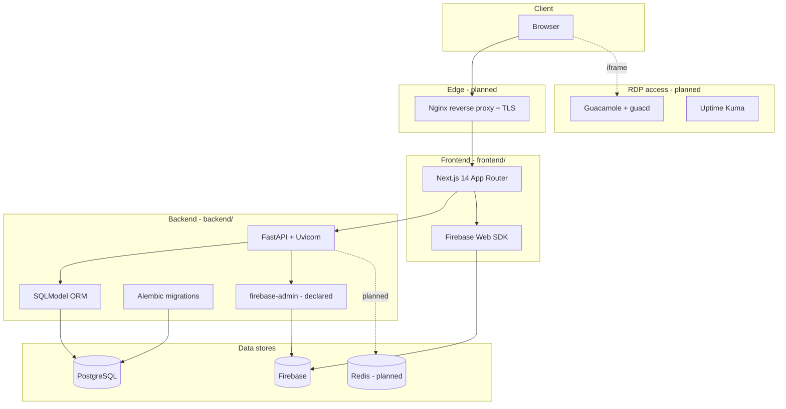

**Document:** Complete technology stack reference
**Version:** 1.0
**Status:** Living document — reflects the repository as currently committed
**Charter reference:** Project Charter V2.0 (90-Day Delivery Plan)

This document lists every technology in the GlobalSolutions platform, what it is used for, and **exactly which folder or file uses it**. It is grounded in what is actually committed to the repository, not only what the architecture plans describe.

---

## Status legend

Because the project is mid-build (Phase 0 complete, Phase 1 in progress), each technology is tagged with how far it is wired in:

| Tag | Meaning |
| :--- | :--- |
| **Implemented** | Code is committed and wired into the running app |
| **Declared** | Listed as a dependency (e.g. `requirements.txt` / `package.json`) but not yet wired into code |
| **Planned** | Described in README / architecture docs, but no code or config committed yet |

> Where the README or architecture docs describe a technology differently from what the code currently does, this document follows the **code** and notes the gap.

---

## 1. Layer overview

---

## 2. Directory-to-stack map

The fastest way to answer "what runs where". Each row maps a folder to the technology it owns.

| Directory / file | Stack | Status | Purpose |
| :--- | :--- | :--- | :--- |
| `frontend/` | Next.js 14, React 18, TypeScript | Implemented | Web application (all three portals) |
| `frontend/app/` | Next.js App Router | Implemented | Route groups: `worker/`, `admin/`, `leadership/`, `login/`, `reset-password/` |
| `frontend/components/` | React + Tailwind | Implemented | UI: `platform/`, `navigation/`, `shared/`, `theme/`, `auth/`, `landing/`, `layout/` |
| `frontend/lib/` | TypeScript modules | Implemented | `auth/`, `navigation/`, `theme/`, `firebase.ts`, `mock-data.ts`, `pages-registry.ts` |
| `frontend/lib/firebase.ts` | Firebase Web SDK | Implemented | Firebase init: Auth, Firestore, Storage |
| `frontend/lib/auth/` | Custom + Firebase | Implemented | Demo session auth (`config.ts`, `AuthProvider.tsx`, `session-store.ts`) |
| `frontend/pages/*/code.html` | Static HTML | Implemented (legacy) | Original design mockups, kept for reference |
| `frontend/tailwind.config.ts`, `postcss.config.js`, `globals.css` | Tailwind CSS, PostCSS | Implemented | Styling pipeline |
| `backend/` | FastAPI (Python) | Implemented (scaffold) | API service |
| `backend/main.py` | FastAPI + Uvicorn | Implemented | App entry, CORS, `/health`, lifespan table creation |
| `backend/core/config.py` | pydantic-settings | Implemented | Env var loading (`.env`) |
| `backend/core/database.py` | SQLModel + SQLAlchemy engine | Implemented | Engine, `get_session()`, `create_db_and_tables()` |
| `backend/core/security.py` | python-jose (JWT), passlib (bcrypt) | Implemented | Password hashing, JWT issue/verify, `get_current_user` |
| `backend/core/permissions.py` | FastAPI deps | Implemented | Role-based access logic |
| `backend/models/` | SQLModel | Implemented | ORM + schema models (`worker.py`, `session.py`, `rdp_machine.py`, `shift.py`, `payroll.py`, `quality.py`, `partner.py`, `audit_log.py`) |
| `backend/migrations/` | Alembic | Implemented (no versions yet) | `env.py`, `script.py.mako`; `versions/` is empty until first migration |
| `backend/alembic.ini` | Alembic | Implemented | Migration config; points `sqlalchemy.url` at PostgreSQL |
| `backend/routers/` | FastAPI routers | Planned | Listed in README; not yet committed (commented out in `main.py`) |
| `backend/schemas/` | Pydantic | Planned | Request/response shapes; currently folded into SQLModel `*Create/*Read/*Update` |
| `backend/services/` | Python business logic | Planned | RDP state machine, payroll/quality engines, firebase sync |
| `infrastructure/nginx/` | Nginx | Planned | Only `README.md` placeholder committed |
| `infrastructure/redis/` | Redis | Planned | `redis.conf` described in README, not yet committed |
| `infrastructure/postgres/` | PostgreSQL | Planned | `init.sql` seed described in README, not yet committed |
| `infrastructure/guacamole/` | Apache Guacamole | Planned | Config described in README, not yet committed |
| `infrastructure/uptime-kuma/` | Uptime Kuma | Planned | RDP monitoring config, not yet committed |
| `docker-compose.yml` | Docker Compose | Planned | Referenced across docs; file not yet committed |
| `docs/` | Markdown | Implemented | This and other specs (`data-models.md`, `architecture.md`, etc.) |

---

## 3. Frontend stack (`frontend/`)

Confirmed in `frontend/package.json`.

| Technology | Version | Status | Where used | What it does |
| :--- | :--- | :--- | :--- | :--- |
| **Next.js** | 14.1.0 | Implemented | `frontend/app/**`, `next.config.js` | App Router framework; route groups per portal, server/client components |
| **React** | 18.2 | Implemented | `frontend/app/**`, `frontend/components/**` | UI component model |
| **TypeScript** | 5.3 | Implemented | All `.ts`/`.tsx`, `tsconfig.json` | Static typing |
| **Tailwind CSS** | 3.4 | Implemented | `tailwind.config.ts`, `app/globals.css`, every component | Utility-first styling (Deep Emerald & Gold design system) |
| **PostCSS / Autoprefixer** | 8.4 / 10.4 | Implemented | `postcss.config.js` | CSS build pipeline |
| **Framer Motion** | 11.x | Implemented | Components with animation | Transitions, glassmorphism motion |
| **lucide-react** | 0.344 | Implemented | Components | Icon set |
| **clsx + tailwind-merge** | 2.x | Implemented | Components | Conditional / de-duplicated class names |
| **Firebase Web SDK** | 12.14 | Implemented | `frontend/lib/firebase.ts` | Initializes `auth`, Firestore `db`, `storage`; exports `COLLECTIONS` |

Notes:
- `frontend/lib/firebase.ts` initializes **Firebase Auth, Firestore, and Storage** from `NEXT_PUBLIC_FIREBASE_*` env vars. It currently targets **Firestore** (`getFirestore`), whereas some architecture docs mention "Realtime Database" — the code uses Firestore.
- `frontend/lib/auth/` currently implements a **demo session model** (`DEMO_ACCOUNTS`, cookie-based) for the three roles (`worker`, `admin`, `executive`). Live Firebase Auth enforcement is a Phase 1 task.

---

## 4. Backend stack (`backend/`)

Confirmed in `backend/requirements.txt`.

| Technology | Version | Status | Where used | What it does |
| :--- | :--- | :--- | :--- | :--- |
| **FastAPI** | 0.111 | Implemented | `backend/main.py`, `core/security.py` | HTTP API framework; CORS, dependency injection, `/health`, auto docs at `/docs` |
| **Uvicorn** | 0.29 | Declared | run target for `main.py` | ASGI server (run command not yet scripted) |
| **SQLModel** | 0.0.19 | Implemented | `backend/models/**`, `core/database.py` | ORM **and** Pydantic schemas in one. Each entity defines `Base` / `Create` / `Read` / `Update` (see `models/worker.py`) |
| **SQLAlchemy** | (via SQLModel) | Implemented | `core/database.py`, `migrations/env.py` | Engine and metadata under SQLModel; `create_engine` with pooling |
| **Alembic** | 1.13.1 | Implemented (no versions) | `backend/alembic.ini`, `backend/migrations/env.py` | Schema migrations; `target_metadata = SQLModel.metadata`, `compare_type=True`; reads `DATABASE_URL` env |
| **psycopg2-binary** | 2.9.9 | Implemented | DB driver for `DATABASE_URL` | PostgreSQL driver used by the engine |
| **Pydantic** | 2.7.1 | Implemented | SQLModel models, validation | Data validation (SQLModel builds on it) |
| **pydantic-settings** | 2.2.1 | Implemented | `backend/core/config.py` | Loads settings from `.env` (`DATABASE_URL`, Firebase, CORS, JWT) |
| **email-validator** | 2.1.1 | Declared | worker email fields | Email format validation |
| **python-jose[cryptography]** | 3.3.0 | Implemented | `backend/core/security.py` | JWT encode/decode for access tokens |
| **passlib[bcrypt]** | 1.7.4 | Implemented | `backend/core/security.py` | Password hashing (`bcrypt`) |
| **python-multipart** | 0.0.9 | Declared | form/file uploads | Required for FastAPI form parsing |
| **firebase-admin** | 6.5.0 | Declared | (backend Firebase sync) | Server-side Firebase writes; **not yet wired** into `main.py` or services |
| **python-dotenv** | 1.0.1 | Declared | local env loading | `.env` loading helper |
| **httpx** | 0.27.0 | Declared | outbound HTTP | Client for external calls (e.g. Guacamole, integrations) |

### Auth: current vs planned

There is an important gap to be aware of:

- **Code today** (`backend/core/security.py`): authentication is **local JWT** — `python-jose` issues/verifies tokens, `passlib` hashes passwords, and `get_current_user` reads a Bearer token.
- **README / charter** describe **Firebase Auth** as the authentication mechanism (`firebase-admin` token verification).
- `firebase-admin` is declared but not yet imported anywhere in `backend/`.

This means the backend auth approach is **in transition**; reconcile JWT vs Firebase Auth before Phase 1 sign-off.

---

## 5. Data stores

| Store | Status | Where configured | Role in the system |
| :--- | :--- | :--- | :--- |
| **PostgreSQL** | Implemented (connection) | `backend/core/config.py` (`DATABASE_URL`), `core/database.py`, `alembic.ini` | Source of truth — all canonical records (workers, sessions, payroll, audit). See `docs/data-models.md` |
| **Firebase (Firestore)** | Implemented (frontend) / Declared (backend) | `frontend/lib/firebase.ts`; `firebase-admin` declared | Real-time mirror — live RDP board, active sessions, notifications, leaderboard. Not the source of truth |
| **Redis** | Planned | `infrastructure/redis/redis.conf` (README only) | Distributed RDP claim locks, session heartbeats, claim rate-limiting. **No Redis client in `requirements.txt` yet** and no config committed |

### How each maps to the data model

The data model in `docs/data-models.md` already routes data across these three stores:

- **PostgreSQL** holds every table in Appendix A of `data-models.md`.
- **Firebase** holds the 5 real-time collection paths (`/rdp_status`, `/active_sessions`, `/shift_notifications`, `/leaderboard/current_period`, `/system_alerts`).
- **Redis** holds the 3 ephemeral keys (`lock:rdp:{id}`, `heartbeat:session:{id}`, `rate:claim:{worker_id}`).

> Redis is fully specified in the data model and architecture but is the least-built piece in code today. Adding a Redis client (e.g. `redis-py`) to `backend/requirements.txt` and a `infrastructure/redis/redis.conf` is the next step to realize the claim-locking flow.

---

## 6. Infrastructure and operations

All of the following are described in `README.md` (Deployment Architecture) but are **planned** — only `infrastructure/nginx/README.md` is committed. There is no `docker-compose.yml` on disk yet.

| Technology | Status | Intended location | Role |
| :--- | :--- | :--- | :--- |
| **Docker Compose** | Planned | `docker-compose.yml` (root) | Orchestrates all containers on a single VPS |
| **Nginx** | Planned | `infrastructure/nginx/` | Reverse proxy + TLS termination (ports 80/443) |
| **Apache Guacamole + guacd** | Planned | `infrastructure/guacamole/` | Browser-based RDP gateway; issues session tokens, holds RDP credentials |
| **Uptime Kuma** | Planned | `infrastructure/uptime-kuma/` | Independent RDP machine monitoring (TCP ping), alerts (port 3001) |
| **Health monitor** | Planned | (Python worker container) | Polls RDP machines every 30s, updates PostgreSQL + Firebase status |
| **PostgreSQL seed** | Planned | `infrastructure/postgres/init.sql` | Initial schema/seed for local bring-up |

---

## 7. Tooling and conventions

| Tool | Status | Where | Purpose |
| :--- | :--- | :--- | :--- |
| **npm** | Implemented | `package.json`, `frontend/package.json` | Frontend dependency + script management (`dev`, `build`, `start`, `lint`) |
| **pip / requirements.txt** | Implemented | `backend/requirements.txt` | Backend dependency management (no `pyproject.toml`) |
| **ESLint (next lint)** | Implemented | `frontend` `lint` script | Frontend linting |
| **Git** | Implemented | repo root | Version control |
| **Environment files** | Implemented | `.env.example`, `frontend/.env.local.example`, `backend/.env.example` | Config templates; no secrets committed |

---

## 8. Summary by question

**"Where is SQLModel used?"** — `backend/models/*.py` (all entity models) and `backend/core/database.py` (engine + session). SQLModel replaces the README's mention of "SQLAlchemy ORM"; it is built on SQLAlchemy and provides Pydantic schemas in the same class.

**"Where is Alembic used?"** — `backend/alembic.ini` and `backend/migrations/env.py` (with `script.py.mako`). It targets `SQLModel.metadata` and reads `DATABASE_URL`. No version migrations have been generated yet (`migrations/versions/` is empty) — the first will be created in Phase 1 Week 2.

**"Where is Redis used?"** — Specified in `docs/data-models.md` and `README.md` for claim locks, heartbeats, and rate limiting at `infrastructure/redis/`, but **not yet implemented** in code or dependencies.

**"Where is Firebase used?"** — Frontend: `frontend/lib/firebase.ts` (Auth, Firestore, Storage). Backend: `firebase-admin` is declared in `requirements.txt` for server-side mirroring but is **not yet wired**.

**"Where is FastAPI / PostgreSQL used?"** — FastAPI in `backend/main.py` and `backend/core/`; PostgreSQL via `psycopg2-binary` and `DATABASE_URL` configured in `backend/core/config.py`, `core/database.py`, and `alembic.ini`.

---

## 9. Known doc-vs-code gaps to reconcile

1. **ORM naming** — README says "SQLAlchemy ORM models"; code uses **SQLModel** (`requirements.txt`, `models/`). Treat SQLModel as authoritative.
2. **Auth mechanism** — README/charter say Firebase Auth; backend code currently uses **local JWT + bcrypt**. `firebase-admin` is declared but unused.
3. **Firebase product** — Some docs say "Realtime Database"; `frontend/lib/firebase.ts` uses **Firestore**.
4. **Backend folders** — `routers/`, `schemas/`, `services/` are in the README layout but not yet committed; schemas currently live inside SQLModel models.
5. **Infrastructure** — `docker-compose.yml` and most `infrastructure/*` configs are described but not yet committed; only `infrastructure/nginx/README.md` exists.

---

*Prepared for GlobalSolutions Phase 1. Reflects the repository as committed; update as code lands. Confidential.*
