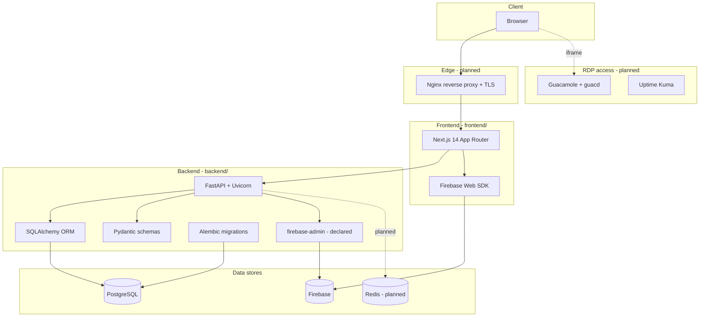

**Document:** Complete technology stack reference
**Version:** 1.0
**Status:** Living document — reflects the repository as currently committed
**Charter reference:** Project Charter V2.0 (90-Day Delivery Plan)

This document lists every technology in the GlobalSolutions platform, what it is used for, and **exactly which folder or file uses it**. It is grounded in what is actually committed to the repository, not only what the architecture plans describe.

---

## Status legend

Because the project is mid-build (Phase 0 complete, Phase 1 in progress), each technology is tagged with how far it is wired in:

| Tag | Meaning |
| :--- | :--- |
| **Implemented** | Code is committed and wired into the running app |
| **Declared** | Listed as a dependency (e.g. `requirements.txt` / `package.json`) but not yet wired into code |
| **Planned** | Described in README / architecture docs, but no code or config committed yet |

> Where the README or architecture docs describe a technology differently from what the code currently does, this document follows the **code** and notes the gap.

---

## 1. Layer overview

---

## 2. Directory-to-stack map

The fastest way to answer "what runs where". Each row maps a folder to the technology it owns.

| Directory / file | Stack | Status | Purpose |
| :--- | :--- | :--- | :--- |
| `frontend/` | Next.js 14, React 18, TypeScript | Implemented | Web application (all three portals) |
| `frontend/app/` | Next.js App Router | Implemented | **Routing: App Router only** — route groups: `worker/`, `admin/`, `leadership/`, `login/`, `reset-password/`; sitemap at `app/pages/page.tsx` (`/pages`) |
| `frontend/components/` | React + Tailwind | Implemented | UI: `platform/`, `navigation/`, `shared/`, `theme/`, `auth/`, `landing/`, `layout/` |
| `frontend/lib/` | TypeScript modules | Implemented | `auth/`, `navigation/`, `theme/`, `firebase.ts`, `mock-data.ts`, `pages-registry.ts` |
| `frontend/lib/firebase.ts` | Firebase Web SDK | Implemented | Firebase init: Auth, Firestore, Storage |
| `frontend/lib/auth/` | Custom + Firebase | Implemented | Demo session auth (`config.ts`, `AuthProvider.tsx`, `session-store.ts`) |
| `frontend/tailwind.config.ts`, `postcss.config.js`, `globals.css` | Tailwind CSS, PostCSS | Implemented | Styling pipeline |
| `backend/` | FastAPI (Python) | Implemented (scaffold) | API service |
| `backend/main.py` | FastAPI + Uvicorn | Implemented | App entry, CORS, `/health`, domain routers |
| `backend/core/config.py` | pydantic-settings | Implemented | Env var loading (`.env`) |
| `backend/core/database.py` | SQLAlchemy engine | Implemented | Engine, `SessionLocal`, `get_db()` dependency |
| `backend/core/security.py` | python-jose (JWT), passlib (bcrypt) | Implemented | Password hashing, JWT issue/verify, `get_current_user` |
| `backend/core/permissions.py` | FastAPI deps | Implemented | Role-based access logic |
| `backend/models/` | SQLAlchemy | Implemented | Declarative ORM models (`worker.py`, `session.py`, `rdp_machine.py`, `shift.py`, `payroll.py`, `quality.py`, `partner.py`, `audit_log.py`, …) |
| `backend/migrations/` | Alembic | Implemented | `env.py`, `script.py.mako`, `versions/` with initial schema migration |
| `backend/alembic.ini` | Alembic | Implemented | Migration config; points `sqlalchemy.url` at PostgreSQL |
| `backend/routers/` | FastAPI routers | Implemented | `auth.py`, `workers.py`, `shifts.py`, `rdp.py`, `sessions.py`, `payroll.py`, `quality.py`, `leaderboard.py`, `audit.py` |
| `backend/schemas/` | Pydantic | Implemented | Request/response shapes (`*Create`, `*Update`, `*Response`) separate from ORM models |
| `backend/services/` | Python business logic | Implemented | `firebase_mirror.py` (Firestore writes after PG commits), `rdp_health.py` (Uptime Kuma webhook handler), `leaderboard_sync.py` (background loop every 5 min), `rdp_state_machine.py`, `payroll_engine.py`, `quality_engine.py`, `session_engine.py` |
| `infrastructure/nginx/` | Nginx | Planned | Only `README.md` placeholder committed |
| `infrastructure/docker-compose.yml` | Docker Compose | Implemented | Runs Redis, Guacamole (guacd + web + its own Postgres), and Uptime Kuma. **Does not include the main app PostgreSQL** — run that separately. |
| `infrastructure/uptime-kuma/` | Uptime Kuma | Implemented | Included in docker-compose; listens on port 3001; sends TCP heartbeat webhooks to the backend |
| `docs/` | Markdown | Implemented | Specs: `data-models.md`, `tech-stack.md`, `worker-layer-setup.md` (Phase 1 worker build runbook), etc. |

---

## 3. Frontend stack (`frontend/`)

Confirmed in `frontend/package.json`.

| Technology | Version | Status | Where used | What it does |
| :--- | :--- | :--- | :--- | :--- |
| **Next.js** | 14.1.0 | Implemented | `frontend/app/**`, `next.config.js` | App Router framework; route groups per portal, server/client components |
| **React** | 18.2 | Implemented | `frontend/app/**`, `frontend/components/**` | UI component model |
| **TypeScript** | 5.3 | Implemented | All `.ts`/`.tsx`, `tsconfig.json` | Static typing |
| **Tailwind CSS** | 3.4 | Implemented | `tailwind.config.ts`, `app/globals.css`, every component | Utility-first styling (Deep Emerald & Gold design system) |
| **PostCSS / Autoprefixer** | 8.4 / 10.4 | Implemented | `postcss.config.js` | CSS build pipeline |
| **Framer Motion** | 11.x | Implemented | Components with animation | Transitions, glassmorphism motion |
| **lucide-react** | 0.344 | Implemented | Components | Icon set |
| **clsx + tailwind-merge** | 2.x | Implemented | Components | Conditional / de-duplicated class names |
| **Firebase Web SDK** | 12.14 | Implemented | `frontend/lib/firebase.ts` | Initializes `auth`, Firestore `db`, `storage`; exports `COLLECTIONS` |

Notes:
- **Routing is App Router only** (`frontend/app/`). There is no Next.js Pages Router in this project. Legacy HTML design mockups were removed; live screens live under `app/`. An empty `frontend/pages/` directory is kept so Next.js dev/build does not throw `ENOENT` when scanning for Pages Router routes.
- `frontend/lib/firebase.ts` initializes **Firebase Auth, Firestore, and Storage** from `NEXT_PUBLIC_FIREBASE_*` env vars. It currently targets **Firestore** (`getFirestore`), whereas some architecture docs mention "Realtime Database" — the code uses Firestore.
- `frontend/lib/auth/` currently implements a **demo session model** (`DEMO_ACCOUNTS`, cookie-based) for the three roles (`worker`, `admin`, `executive`). Live Firebase Auth enforcement is a Phase 1 task.

---

## 4. Backend stack (`backend/`)

Confirmed in `backend/requirements.txt`.

| Technology | Version | Status | Where used | What it does |
| :--- | :--- | :--- | :--- | :--- |
| **FastAPI** | 0.111 | Implemented | `backend/main.py`, `core/security.py` | HTTP API framework; CORS, dependency injection, `/health`, auto docs at `/docs` |
| **Uvicorn** | 0.29 | Declared | run target for `main.py` | ASGI server (run command not yet scripted) |
| **SQLModel** | 0.0.21 | Implemented | `backend/models/**`, `migrations/env.py` | ORM layer — combines SQLAlchemy and Pydantic; all entity models inherit from `SQLModel, table=True` |
| **SQLAlchemy** | 2.0.30 | Implemented | `core/database.py`, underlying SQLModel | Engine + session in `database.py`; raw column/type definitions used inside SQLModel fields |
| **Alembic** | 1.13.1 | Implemented | `backend/alembic.ini`, `backend/migrations/env.py`, `migrations/versions/` | Schema migrations; `target_metadata = Base.metadata`, `compare_type=True`; reads `DATABASE_URL` env |
| **psycopg2-binary** | 2.9.9 | Implemented | DB driver for `DATABASE_URL` | PostgreSQL driver used by the engine |
| **Pydantic** | 2.7.1 | Implemented | `backend/schemas/**`, `routers/auth.py` | API request/response validation (`*Create`, `*Update`, `*Response`) |
| **pydantic-settings** | 2.2.1 | Implemented | `backend/core/config.py` | Loads settings from `.env` (`DATABASE_URL`, Firebase, CORS, JWT) |
| **email-validator** | 2.1.1 | Declared | worker email fields | Email format validation |
| **passlib[bcrypt]** | 1.7.4 | Implemented | `backend/core/security.py` | Password hashing (`bcrypt`) — used for any local credential storage |
| **firebase-admin** | 6.5.0 | Implemented | `backend/core/firebase_admin.py`, `core/security.py` | Token verification (`verify_id_token`), user management (create, approve, reject, list, set custom claims), Firestore writes via services |
| **python-dotenv** | 1.0.1 | Declared | local env loading | `.env` loading helper |
| **httpx** | 0.27.0 | Declared | outbound HTTP | Client for external calls (e.g. Guacamole, integrations) |

### Auth: current vs planned

There is an important gap to be aware of:

- **Code today** (`backend/core/security.py`): authentication is **local JWT** — `python-jose` issues/verifies tokens, `passlib` hashes passwords, and `get_current_user` reads a Bearer token.
- **README / charter** describe **Firebase Auth** as the authentication mechanism (`firebase-admin` token verification).
- `firebase-admin` is declared but not yet imported anywhere in `backend/`.

This means the backend auth approach is **in transition**; reconcile JWT vs Firebase Auth before Phase 1 sign-off.

---

## 5. Data stores

| Store | Status | Where configured | Role in the system |
| :--- | :--- | :--- | :--- |
| **PostgreSQL** | Implemented | `backend/core/config.py` (`DATABASE_URL`), `core/database.py`, `alembic.ini` | Source of truth — all canonical records (workers, sessions, payroll, audit). **Not in docker-compose** — run separately (local install or separate container). See `docs/data-models.md` |
| **Firebase (Firestore)** | Implemented (frontend + backend) | `frontend/lib/firebase.ts`; `backend/core/firebase_admin.py`; `backend/services/firebase_mirror.py` | Real-time mirror — live RDP board, active sessions, leaderboard. Backend writes after every PostgreSQL commit. Not the source of truth. |
| **Redis** | Implemented | `backend/core/redis.py`, `backend/core/guacamole.py`, `infrastructure/docker-compose.yml` | Distributed RDP claim locks (`lock:rdp:{id}`, 30s TTL), session heartbeats (`heartbeat:session:{id}`), Guacamole token cache. Runs via docker-compose (port 6379). |

### How each maps to the data model

The data model in `docs/data-models.md` already routes data across these three stores:

- **PostgreSQL** holds every table in Appendix A of `data-models.md`.
- **Firebase** holds the 5 real-time collection paths (`/rdp_status`, `/active_sessions`, `/shift_notifications`, `/leaderboard/current_period`, `/system_alerts`).
- **Redis** holds the 3 ephemeral keys (`lock:rdp:{id}`, `heartbeat:session:{id}`, `rate:claim:{worker_id}`).

> Redis is fully specified in the data model and architecture but is the least-built piece in code today. Adding a Redis client (e.g. `redis-py`) to `backend/requirements.txt` and a `infrastructure/redis/redis.conf` is the next step to realize the claim-locking flow.

---

## 6. Infrastructure and operations

All of the following are described in `README.md` (Deployment Architecture) but are **planned** — only `infrastructure/nginx/README.md` is committed. There is no `docker-compose.yml` on disk yet.

| Technology | Status | Intended location | Role |
| :--- | :--- | :--- | :--- |
| **Docker Compose** | Implemented | `infrastructure/docker-compose.yml` | Runs Redis, Guacamole (guacd + web + dedicated Postgres), and Uptime Kuma. Main app PostgreSQL is **not** in this file — run it separately. |
| **Apache Guacamole + guacd** | Implemented | `infrastructure/docker-compose.yml`, `backend/core/guacamole.py` | Browser-based RDP gateway (port 8080). Backend fetches token + builds connection URL. Guacamole uses its own dedicated Postgres (`guac_db`). |
| **Uptime Kuma** | Implemented | `infrastructure/docker-compose.yml`, `backend/routers/uptime_kuma.py`, `backend/services/rdp_health.py` | TCP port 3389 monitoring for RDP machines (port 3001). Sends webhook to backend on up/down events. Match monitors to machines by nickname. |
| **Nginx** | Planned | `infrastructure/nginx/` | Reverse proxy + TLS termination (ports 80/443) — config not yet committed |
| **Health monitor** | Planned | (Python worker container) | Polls RDP machines every 30s, updates PostgreSQL + Firebase status — not yet implemented |

---

## 7. Tooling and conventions

| Tool | Status | Where | Purpose |
| :--- | :--- | :--- | :--- |
| **npm** | Implemented | `package.json`, `frontend/package.json` | Frontend dependency + script management (`dev`, `build`, `start`, `lint`) |
| **pip / requirements.txt** | Implemented | `backend/requirements.txt` | Backend dependency management (no `pyproject.toml`) |
| **ESLint (next lint)** | Implemented | `frontend` `lint` script | Frontend linting |
| **Git** | Implemented | repo root | Version control |
| **Environment files** | Implemented | `.env.example`, `frontend/.env.local.example`, `backend/.env.example` | Config templates; no secrets committed |

---

## 8. Summary by question

**"Where is SQLAlchemy used?"** — `backend/models/*.py` (all entity ORM models) and `backend/core/database.py` (engine + `get_db()` session dependency). Pydantic API shapes live separately in `backend/schemas/`.

**"Where is Alembic used?"** — `backend/alembic.ini` and `backend/migrations/env.py` (with `script.py.mako`). It targets `Base.metadata` from `models/base.py` and reads `DATABASE_URL`. Initial migration in `migrations/versions/`.

**"Where is Redis used?"** — Specified in `docs/data-models.md` and `README.md` for claim locks, heartbeats, and rate limiting at `infrastructure/redis/`, but **not yet implemented** in code or dependencies.

**"Where is Firebase used?"** — Frontend: `frontend/lib/firebase.ts` (Auth, Firestore, Storage). Backend: `firebase-admin` is declared in `requirements.txt` for server-side mirroring but is **not yet wired**.

**"Where is FastAPI / PostgreSQL used?"** — FastAPI in `backend/main.py` and `backend/core/`; PostgreSQL via `psycopg2-binary` and `DATABASE_URL` configured in `backend/core/config.py`, `core/database.py`, and `alembic.ini`.

---

## 9. Known doc-vs-code gaps to reconcile

1. **ORM** — Models use **SQLModel** (not plain SQLAlchemy). SQLModel wraps SQLAlchemy + Pydantic; all entity models are `class Foo(SQLModel, table=True)`. Older docs that say "SQLAlchemy ORM models" are slightly off.
2. **Firebase product** — Some docs say "Realtime Database"; `frontend/lib/firebase.ts` and the backend both use **Firestore**.
3. **Main app PostgreSQL** — Not in `docker-compose.yml`. You run it separately (local Postgres install or your own container). `DATABASE_URL` in `.env` points to it.
4. **python-jose removed** — Older docs mention JWT/python-jose. Authentication is now entirely Firebase — `firebase-admin` verifies ID tokens server-side; `python-jose` is no longer in `requirements.txt`.

---

*Prepared for GlobalSolutions Phase 1. Reflects the repository as committed; update as code lands. Confidential.*
