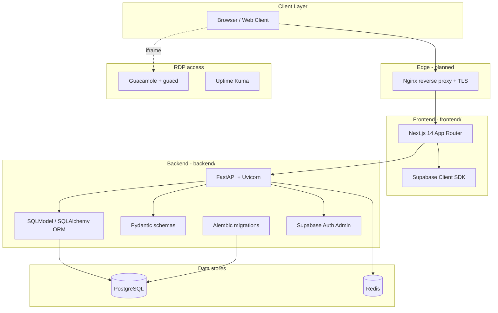

# GlobalSolutions Tech Stack Map

> Single source of truth for every technology, framework, library, and tool in this repository.  
> Cross-references the directory layout, configuration files, and dependencies to clarify what is currently implemented vs planned.

---

## 1. System architecture diagram

```mermaid
graph TD
    subgraph client [Client Layer]
        Browser[Browser / Web Client]
    end

    subgraph edge [Edge - planned]
        Nginx[Nginx reverse proxy + TLS]
    end

    subgraph fe [Frontend - frontend/]
        Next[Next.js 14 App Router]
        SupaSdk[Supabase Client SDK]
    end

    subgraph be [Backend - backend/]
        FastApi[FastAPI + Uvicorn]
        SqlModel[SQLModel / SQLAlchemy ORM]
        PydanticSchemas[Pydantic schemas]
        Alembic[Alembic migrations]
        SupaAuth[Supabase Auth Admin]
    end

    subgraph data [Data stores]
        Postgres[(PostgreSQL)]
        Redis[(Redis)]
    end

    subgraph rdp [RDP access]
        Guac[Guacamole + guacd]
        Kuma[Uptime Kuma]
    end

    Browser --> Nginx --> Next
    Next --> FastApi
    Next --> SupaSdk
    FastApi --> SqlModel --> Postgres
    FastApi --> PydanticSchemas
    Alembic --> Postgres
    FastApi --> SupaAuth
    FastApi --> Redis
    Browser -.iframe.-> Guac
```

---

## 2. Directory-to-stack map

The fastest way to answer "what runs where". Each row maps a folder to the technology it owns.

| Directory / file | Stack | Status | Purpose |
| :--- | :--- | :--- | :--- |
| `frontend/` | Next.js 14, React 18, TypeScript | Implemented | Web application (all three portals) |
| `frontend/app/` | Next.js App Router | Implemented | **Routing: App Router only** — route groups: `worker/`, `admin/`, `leadership/`, `login/`, `reset-password/`; sitemap at `app/pages/page.tsx` (`/pages`) |
| `frontend/components/` | React + Tailwind | Implemented | UI: `platform/`, `navigation/`, `shared/`, `theme/`, `auth/`, `landing/`, `layout/` |
| `frontend/lib/` | TypeScript modules | Implemented | `auth/`, `navigation/`, `theme/`, `supabase.ts`, `api.ts`, `rdp.ts`, `errors.ts`, `pages-registry.ts` |
| `frontend/lib/supabase.ts` | Supabase JS SDK | Implemented | Supabase client initialization |
| `frontend/lib/auth/` | Custom + Supabase | Implemented | Live Supabase session auth (`supabase-auth.ts`, `AuthProvider.tsx`, `session-store.ts`) |
| `frontend/tailwind.config.ts`, `postcss.config.js`, `globals.css` | Tailwind CSS, PostCSS | Implemented | Styling pipeline |
| `backend/` | FastAPI (Python) | Implemented | API service |
| `backend/main.py` | FastAPI + Uvicorn | Implemented | App entry, CORS, `/health`, domain routers |
| `backend/core/config.py` | pydantic-settings | Implemented | Env var loading (`.env`) |
| `backend/core/database.py` | SQLAlchemy engine | Implemented | Engine, `SessionLocal`, `get_db()` dependency |
| `backend/core/supabase_auth.py` | PyJWT / GoTrue admin | Implemented | Token verification (JWKS / secret), user admin |
| `backend/core/permissions.py` | FastAPI deps | Implemented | Role-based access logic |
| `backend/models/` | SQLModel | Implemented | Declarative ORM models (`worker.py`, `session.py`, `rdp_resource.py`, `shift.py`, `payroll.py`, `quality.py`, `partner.py`, `audit_log.py`, …) |
| `backend/migrations/` | Alembic | Implemented | `env.py`, `script.py.mako`, `versions/` with schema migrations |
| `backend/alembic.ini` | Alembic | Implemented | Migration config; points `sqlalchemy.url` at PostgreSQL |
| `backend/routers/` | FastAPI routers | Implemented | `auth.py`, `workers.py`, `shifts.py`, `rdp.py`, `sessions.py`, `payroll.py`, `quality.py`, `leaderboard.py`, `audit.py` |
| `backend/schemas/` | Pydantic | Implemented | Request/response shapes (`*Create`, `*Update`, `*Response`) separate from ORM models |
| `backend/services/` | Python business logic | Implemented | `rdp_health.py` (Uptime Kuma webhook handler), `leaderboard_sync.py` (background loop every 5 min), `rdp_state_machine.py`, `payroll_engine.py`, `quality_engine.py`, `session_engine.py` |
| `infrastructure/nginx/` | Nginx | Planned | Only `README.md` placeholder committed |
| `infrastructure/docker-compose.yml` | Docker Compose | Implemented | Runs Redis, Guacamole (guacd + web + its own Postgres), and Uptime Kuma. |
| `infrastructure/uptime-kuma/` | Uptime Kuma | Implemented | Included in docker-compose; listens on port 3001; sends TCP heartbeat webhooks to the backend |
| `docs/` | Markdown | Implemented | Specs: `data-models.md`, `tech-stack.md`, `worker-layer-setup.md`, etc. |

---

## 3. Frontend stack (`frontend/`)

Confirmed in `frontend/package.json`.

| Technology | Version | Status | Where used | What it does |
| :--- | :--- | :--- | :--- | :--- |
| **Next.js** | 14.2.35 | Implemented | `frontend/app/**`, `next.config.js` | App Router framework; route groups per portal, server/client components |
| **React** | 18.2 | Implemented | `frontend/app/**`, `frontend/components/**` | UI component model |
| **TypeScript** | 5.3 | Implemented | All `.ts`/`.tsx`, `tsconfig.json` | Static typing |
| **Tailwind CSS** | 3.4 | Implemented | `tailwind.config.ts`, `app/globals.css`, every component | Utility-first styling (Deep Emerald & Gold design system) |
| **PostCSS / Autoprefixer** | 8.4 / 10.4 | Implemented | `postcss.config.js` | CSS build pipeline |
| **Framer Motion** | 11.x | Implemented | Components with animation | Transitions, glassmorphism motion |
| **lucide-react** | 0.344 | Implemented | Components | Icon set |
| **clsx + tailwind-merge** | 2.x | Implemented | Components | Conditional / de-duplicated class names |
| **Supabase JS SDK** | 2.x | Implemented | `frontend/lib/supabase.ts`, `auth/supabase-auth.ts` | Supabase client for authentication |

---

## 4. Backend stack (`backend/`)

Confirmed in `backend/requirements.txt`.

| Technology | Version | Status | Where used | What it does |
| :--- | :--- | :--- | :--- | :--- |
| **FastAPI** | 0.111 | Implemented | `backend/main.py`, `core/security.py` | HTTP API framework; CORS, dependency injection, `/health`, auto docs at `/docs` |
| **Uvicorn** | 0.29 | Implemented | run target for `main.py` | ASGI server |
| **SQLModel** | 0.0.21 | Implemented | `backend/models/**`, `migrations/env.py` | ORM layer — combines SQLAlchemy and Pydantic; all entity models inherit from `SQLModel, table=True` |
| **SQLAlchemy** | 2.0.30 | Implemented | `core/database.py`, underlying SQLModel | Engine + session in `database.py`; raw column/type definitions used inside SQLModel fields |
| **Alembic** | 1.13.1 | Implemented | `backend/alembic.ini`, `backend/migrations/env.py`, `migrations/versions/` | Schema migrations; reads `DATABASE_URL` env |
| **psycopg2-binary** | 2.9.9 | Implemented | DB driver for `DATABASE_URL` | PostgreSQL driver used by the engine |
| **Pydantic** | 2.7.1 | Implemented | `backend/schemas/**`, `routers/auth.py` | API request/response validation (`*Create`, `*Update`, `*Response`) |
| **pydantic-settings** | 2.2.1 | Implemented | `backend/core/config.py` | Loads settings from `.env` (`DATABASE_URL`, Supabase, CORS, JWT) |
| **email-validator** | 2.1.1 | Implemented | worker email fields | Email format validation |
| **httpx** | 0.27.0 | Implemented | outbound HTTP | Client for external calls (e.g. Guacamole, integrations) |
| **PyJWT** | 2.8.0 | Implemented | `core/supabase_auth.py` | Validates RS256/HS256 tokens from Supabase |

---

## 5. Data stores

| Store | Status | Where configured | Role in the system |
| :--- | :--- | :--- | :--- |
| **PostgreSQL** | Implemented | `backend/core/config.py` (`DATABASE_URL`), `core/database.py`, `alembic.ini` | Source of truth — all canonical records (workers, sessions, payroll, audit). |
| **Redis** | Implemented | `backend/core/redis.py`, `backend/core/guacamole.py`, `infrastructure/docker-compose.yml` | Distributed RDP claim locks (`lock:rdp:{id}`, 30s TTL), session heartbeats (`heartbeat:session:{id}`), Guacamole token cache. Runs via docker-compose (port 6379). |

---

## 6. Infrastructure and operations

| Technology | Status | Intended location | Role |
| :--- | :--- | :--- | :--- |
| **Docker Compose** | Implemented | `infrastructure/docker-compose.yml` | Runs Redis, Guacamole (guacd + web + dedicated Postgres), and Uptime Kuma. |
| **Apache Guacamole + guacd** | Implemented | `infrastructure/docker-compose.yml`, `backend/core/guacamole.py` | Browser-based RDP gateway (port 8080). Backend fetches token + builds connection URL. Guacamole uses its own dedicated Postgres (`guac_db`). |
| **Uptime Kuma** | Implemented | `infrastructure/docker-compose.yml`, `backend/routers/uptime_kuma.py`, `backend/services/rdp_health.py` | TCP port 3389 monitoring for RDP machines (port 3001). Sends webhook to backend on up/down events. Match monitors to machines by nickname. |
| **Nginx** | Planned | `infrastructure/nginx/` | Reverse proxy + TLS termination (ports 80/443) |

---

## 7. Tooling and conventions

| Tool | Status | Where | Purpose |
| :--- | :--- | :--- | :--- |
| **npm** | Implemented | `package.json`, `frontend/package.json` | Frontend dependency + script management (`dev`, `build`, `start`, `lint`) |
| **pip / requirements.txt** | Implemented | `backend/requirements.txt` | Backend dependency management |
| **ESLint (next lint)** | Implemented | `frontend` `lint` script | Frontend linting |
| **Git** | Implemented | repo root | Version control |
| **Environment files** | Implemented | `.env.example`, `frontend/.env.local.example`, `backend/.env.example` | Config templates; no secrets committed |

---

## 8. Summary by question

**"Where is SQLModel used?"** — `backend/models/*.py` (all entity ORM models) and `backend/core/database.py` (engine + `get_db()` session dependency). Pydantic API shapes live separately in `backend/schemas/`.

**"Where is Alembic used?"** — `backend/alembic.ini` and `backend/migrations/env.py` (with `script.py.mako`). It targets `Base.metadata` from `models/base.py` and reads `DATABASE_URL`. Initial and subsequent migrations in `migrations/versions/`.

**"Where is Redis used?"** — Used for distributed RDP claim locks (`lock:rdp:{id}`), session heartbeats, and Guacamole token caching.

**"Where is Supabase used?"** — Frontend: `frontend/lib/supabase.ts` and `frontend/lib/auth/supabase-auth.ts`. Backend: `backend/core/supabase_auth.py` for JWT signature verification and GoTrue admin API user management.

**"Where is FastAPI / PostgreSQL used?"** — FastAPI in `backend/main.py` and `backend/core/`; PostgreSQL via `psycopg2-binary` and `DATABASE_URL` configured in `backend/core/config.py`, `core/database.py`, and `alembic.ini`.
