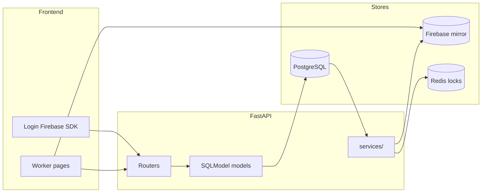

**Document:** Worker layer implementation runbook  
**Version:** 1.0  
**Status:** Phase 1 build guide  
**Related:** [data-models.md](data-models.md) (Layer 1 + Appendix A), [tech-stack.md](tech-stack.md)

This is a **step-by-step procedure** for wiring the Worker portal from **login** through **every sidebar page**, using:

- **SQLModel** — ORM + Pydantic schemas in `backend/models/`
- **Alembic** — PostgreSQL migrations in `backend/migrations/`
- **PostgreSQL** — source of truth (permanent records)
- **Firebase** — real-time mirror (live board, active session, notifications, leaderboard)
- **Redis** — ephemeral locks and heartbeats (claim flow)

**Auth approach:** Firebase Auth end-to-end. Replace the current JWT demo in `backend/core/security.py` with Firebase Admin token verification.

---

## Current state (where you start)

| Area | Status |
| :--- | :--- |
| Frontend worker pages | UI complete; data from `frontend/lib/mock-data.ts` |
| Worker sidebar | 7 routes in `frontend/lib/navigation/config.tsx` + `/login` |
| Backend models | Simplified scaffold in `backend/models/` — **does not match** canonical [data-models.md](data-models.md) |
| Alembic | Configured; `migrations/versions/` empty |
| Routers / Firebase sync | Not implemented (`backend/main.py` has routers commented out) |
| Redis | Specified in data model; not yet in `backend/requirements.txt` |

**Critical:** Align SQLModel models to the canonical schema **before** running `alembic revision --autogenerate`. Do not migrate from the current scaffold as-is.

---

## Stack recap



| Layer | Tool | Location | Role |
| :--- | :--- | :--- | :--- |
| ORM + API shapes | SQLModel | `backend/models/` | Tables + `*Create` / `*Read` / `*Update` per entity |
| Migrations | Alembic | `backend/migrations/versions/` | Versioned schema changes |
| Source of truth | PostgreSQL | `DATABASE_URL` in `.env` | All canonical records |
| Real-time UI | Firebase | Frontend SDK + `firebase-admin` backend | Live RDP board, session timer, notifications, leaderboard |
| Ephemeral | Redis | `REDIS_URL` in `.env` | Claim locks, heartbeats, rate limits |

**Rule:** FastAPI writes PostgreSQL first, then mirrors to Firebase. If Firebase is down, history stays intact in PG; if PG is down, reject new writes.

---

## Setup order — Phases 0 through 8

Follow this sequence. Do not skip ahead to page wiring before models and migrations exist.

### Phase 0 — Infrastructure

**Goal:** All services and env vars ready.

| Step | Action |
| :--- | :--- |
| 0.1 | Run PostgreSQL locally (or Docker). Create database `globalsolutions` and user matching `DATABASE_URL`. |
| 0.2 | Create Firebase project. Enable **Authentication** (Email/Password). Download service account JSON. |
| 0.3 | Run Redis locally (port 6379). |
| 0.4 | Copy `backend/.env.example` → `backend/.env`. Set `DATABASE_URL`, `FIREBASE_CREDENTIALS_PATH`, `FIREBASE_PROJECT_ID`, `FIREBASE_DATABASE_URL` (or Firestore — match frontend). Add `REDIS_URL=redis://localhost:6379/0`. |
| 0.5 | Copy `frontend/.env.local.example` → `frontend/.env.local`. Set all `NEXT_PUBLIC_FIREBASE_*` vars. |

**Exit criteria:** PostgreSQL accepts connections; Firebase console shows project; Redis responds to `PING`.

---

### Phase 1 — Align SQLModel models to canonical schema

**Goal:** `backend/models/` matches [data-models.md Appendix A](data-models.md#appendix-a--canonical-schema) for worker scope.

See [Model alignment](#model-alignment-current-scaffold-vs-canonical) below for the gap list.

| Step | Action |
| :--- | :--- |
| 1.1 | Add/rename models: `admin_users`, `workers`, `partner_entities`, `shifts`, `rdp_resources`, `allocations`, `sessions`, MCQ tables, `quality_composite_scores`. |
| 1.2 | Remove or replace scaffold names: `rdp_machines` → `rdp_resources`, `partners` → `partner_entities`, drop `hashed_password` on workers. |
| 1.3 | Add missing models: `allocations`, `mcq_assessment_sets`, `mcq_questions`, `mcq_results`, `mcq_result_answers`, `quality_composite_scores`. |
| 1.4 | Export all table models from `backend/models/__init__.py` so Alembic autogenerate sees them. |
| 1.5 | Use PostgreSQL enums and JSONB where the schema specifies (`type_specific_fields`, `risk_flags`, etc.). |

**Exit criteria:** Model files match table names and columns in Appendix A for worker tables.

---

### Phase 2 — Alembic migration 001

**Goal:** Create physical tables in PostgreSQL.

```bash
cd backend
alembic revision --autogenerate -m "worker_layer_core"
# Review generated file — fix enums, partial indexes, check constraints manually
alembic upgrade head
```

| Step | Action |
| :--- | :--- |
| 2.1 | Remove `create_db_and_tables()` from production path in `backend/main.py` — use Alembic only in prod. |
| 2.2 | Add partial unique index on `allocations(rdp_resource_id) WHERE released_at IS NULL` in migration if autogenerate misses it. |
| 2.3 | Seed dev data: one worker row, a few `rdp_resources`, one `mcq_assessment_set` (optional script or SQL). |

**Exit criteria:** `\dt` in psql lists worker tables; no autogenerate drift on second run.

---

### Phase 3 — Firebase Auth

**Goal:** Login works; every API call verifies Firebase ID token.

| Step | Action |
| :--- | :--- |
| 3.1 | Create `backend/core/firebase.py` — initialize `firebase_admin` from `FIREBASE_CREDENTIALS_PATH`. |
| 3.2 | Update `backend/core/security.py` — `verify_firebase_token()` replaces JWT `decode_token` for API auth. |
| 3.3 | On first authenticated request: upsert `admin_users` (firebase_uid, email) and link/create `workers` row via `admin_user_id`. |
| 3.4 | Frontend: wire `/login` to Firebase Auth (`frontend/lib/firebase.ts`); store ID token; send `Authorization: Bearer <token>` on API calls via `frontend/lib/api.ts`. |
| 3.5 | Replace demo cookie auth in `frontend/lib/auth/` with Firebase session (keep role routing in `AuthProvider`). |

**Exit criteria:** Worker logs in → token accepted by `GET /health` or `GET /workers/me`.

---

### Phase 4 — Core worker API

**Goal:** Dashboard can show identity.

| Step | Action |
| :--- | :--- |
| 4.1 | Create `backend/routers/workers.py` — `GET /workers/me`, `PATCH /workers/me` (own row only). |
| 4.2 | Register router in `backend/main.py`. |
| 4.3 | Wire worker dashboard header/KPIs to `GET /workers/me` + quality endpoint (Phase 8). |

**Planned endpoints:**

- `GET /workers/me` — returns `WorkerRead`
- `PATCH /workers/me` — update `display_name`, etc.

---

### Phase 5 — Shifts + notifications

**Goal:** Dashboard “Upcoming Shifts” and notification bell.

| Step | Action |
| :--- | :--- |
| 5.1 | Create `backend/routers/shifts.py` — `POST /shifts`, `GET /shifts` (scoped to current worker). |
| 5.2 | Create `backend/services/firebase_sync.py` — write `/shift_notifications/{worker_id}/{notif_id}` after admin approval (worker reads only for now). |
| 5.3 | Wire dashboard shift widget to `GET /shifts?status=approved&upcoming=true`. |

**Admin dependency:** Shift **approval** is Admin layer. Until admin APIs exist, seed approved shifts in dev or stub admin approval in a test script.

**Planned endpoints:**

- `POST /shifts` — worker submits availability
- `GET /shifts` — list own shifts

---

### Phase 6 — RDP board + claim + allocations

**Goal:** RDP Claim Board live; claim starts allocation.

| Step | Action |
| :--- | :--- |
| 6.1 | Add `redis` to `backend/requirements.txt`; create `backend/core/redis.py`. |
| 6.2 | Create `backend/services/rdp_state_machine.py` — 8-state enum transitions. |
| 6.3 | Create `backend/routers/rdp.py` — `GET /rdp` (board), `POST /rdp/{id}/claim`. |
| 6.4 | Claim flow: Redis lock → PG txn → verify `online_free` → insert `allocations` → update `rdp_resources.status` → `audit_log` → Firebase `/rdp_status/{id}`. |
| 6.5 | Frontend RDP board: Firebase listener on `/rdp_status/*` + PG fallback via `GET /rdp`. |

**Planned endpoints:**

- `GET /rdp` — list machines (read board)
- `POST /rdp/{id}/claim` — create allocation (requires approved shift in production)

---

### Phase 7 — Sessions (all three types)

**Goal:** Active Session, Session History, External Logging pages wired.

| Step | Action |
| :--- | :--- |
| 7.1 | Create `backend/routers/sessions.py`. |
| 7.2 | `POST /sessions` — start GS RDP session (links `allocation_id`); multilog / third-party with JSONB `type_specific_fields`. |
| 7.3 | `PATCH /sessions/{id}` — end session, heartbeat; update Redis `heartbeat:session:{id}` and Firebase `/active_sessions/{id}`. |
| 7.4 | `GET /sessions` — own history (filters: type, date range). |
| 7.5 | Wire pages: `active-session`, `session-history`, `external-session`. |

**Planned endpoints:**

- `POST /sessions`
- `GET /sessions`
- `GET /sessions/{id}`
- `PATCH /sessions/{id}` — end, heartbeat
- `POST /sessions/{id}/heartbeat`

---

### Phase 8 — Quality, MCQ, leaderboard

**Goal:** Assessments page, Leaderboard page, dashboard KPIs (rank, score, streak).

| Step | Action |
| :--- | :--- |
| 8.1 | Create `backend/routers/quality.py` — MCQ list, submit answers, read own `quality_composite_scores`. |
| 8.2 | Background job (or cron): recompute leaderboard snapshot → Firebase `/leaderboard/current_period` every 5 minutes from PG. |
| 8.3 | Wire `assessments`, `leaderboard`, dashboard KPI cards. |

**Planned endpoints:**

- `GET /assessments` — active MCQ sets
- `GET /assessments/{id}/questions`
- `POST /assessments/{id}/submit`
- `GET /quality/me` — own composite score + ranks
- `GET /leaderboard` — optional PG read; frontend prefers Firebase snapshot

---

## Worker portal routes (sidebar + login)

From `frontend/lib/navigation/config.tsx`:

| # | Sidebar label | Route |
| :--- | :--- | :--- |
| — | Login | `/login` |
| 1 | Dashboard | `/worker/dashboard` |
| 2 | RDP Claim Board | `/worker/rdp-claim-board` |
| 3 | Active Session | `/worker/active-session` |
| 4 | Session History | `/worker/session-history` |
| 5 | External Logging | `/worker/external-session` |
| 6 | Assessments | `/worker/assessments` |
| 7 | Leaderboard | `/worker/leaderboard` |

---

## Page-by-page data mapping

For each page: **what the UI needs**, **PostgreSQL tables + fields**, **Firebase**, **Redis**, **API endpoints**.

### Login — `/login`

| | |
| :--- | :--- |
| **UI** | Email/password, redirect to `/worker/dashboard` on success |
| **Firebase Auth** | Login; issues ID token (credentials never stored in PG) |
| **PostgreSQL** | `admin_users`: `firebase_uid`, `email`, `role`; `workers`: `id`, `admin_user_id`, `worker_type`, `display_name`, `country`, `status` |
| **Firebase realtime** | — |
| **Redis** | — |
| **API** | `POST /auth/session` or implicit via `GET /workers/me` on first token |

---

### 1. Dashboard — `/worker/dashboard`

| UI widget | PostgreSQL table.fields | Firebase | Redis | API |
| :--- | :--- | :--- | :--- | :--- |
| Profile / welcome | `workers.display_name`, `country` | — | — | `GET /workers/me` |
| Active rank, quality, streak | `quality_composite_scores`: `composite_score`, `country_rank`, `global_rank`, `session_streak_days` | — | — | `GET /quality/me` |
| Upcoming shifts | `shifts`: `scheduled_start`, `scheduled_end`, `status`, `rdp_resource_id` | — | — | `GET /shifts` |
| Recent sessions | `sessions`: `start_time`, `end_time`, `duration_minutes`, `session_type`, `close_status` | — | — | `GET /sessions?limit=5` |
| Notifications | — | `/shift_notifications/{worker_id}/{notif_id}` | — | Firebase listener |
| Leaderboard preview | — | `/leaderboard/current_period` | — | Firebase listener |

---

### 2. RDP Claim Board — `/worker/rdp-claim-board`

| | |
| :--- | :--- |
| **UI** | Grid of machines with live status; Claim button |
| **PostgreSQL (read)** | `rdp_resources`: `id`, `nickname`, `country`, `client_group`, `status`, `assigned_worker_id` |
| **PostgreSQL (write on claim)** | `allocations`: `worker_id`, `rdp_resource_id`, `shift_id`, `claimed_at`, `guacamole_token`; update `rdp_resources.status` → `assigned` |
| **Firebase (read)** | `/rdp_status/{rdp_id}`: `{ status, worker_id, updated_at }` |
| **Redis** | `lock:rdp:{rdp_id}` (30s TTL), `rate:claim:{worker_id}` (60s) |
| **API** | `GET /rdp`, `POST /rdp/{id}/claim` |

**RDP status enum:** `offline`, `online_free`, `assigned`, `active`, `idle`, `unhealthy`, `admin_locked`, `maintenance`.

---

### 3. Active Session — `/worker/active-session`

| | |
| :--- | :--- |
| **UI** | Live timer, machine details, heartbeat indicator, End Session |
| **PostgreSQL** | `sessions`: `id`, `worker_id`, `session_type=gs_rdp`, `allocation_id`, `rdp_resource_id`, `start_time`, `end_time`, `duration_minutes`, `type_specific_fields` (JSONB: `guacamole_connection_token`, `last_heartbeat_at`, …) |
| **PostgreSQL (join)** | `rdp_resources`: `nickname`, `country`, `client_group` |
| **Firebase** | `/active_sessions/{session_id}`: `{ worker_id, rdp_id, started_at, heartbeat_at }` |
| **Redis** | `heartbeat:session:{session_id}` |
| **API** | `GET /sessions/active`, `POST /sessions/{id}/heartbeat`, `PATCH /sessions/{id}` (end) |

---

### 4. Session History — `/worker/session-history`

| | |
| :--- | :--- |
| **UI** | Filterable table of past sessions |
| **PostgreSQL only** | `sessions`: `session_type`, `start_time`, `end_time`, `duration_minutes`, `close_status`; join `rdp_resources.nickname` for GS RDP |
| **Firebase** | — |
| **Redis** | — |
| **API** | `GET /sessions?from=&to=&session_type=` |

**Close status enum:** `completed`, `force_released`, `abandoned`, `timed_out`.

---

### 5. External Logging — `/worker/external-session`

| | |
| :--- | :--- |
| **UI** | Log partner multilog or third-party platform hours |
| **PostgreSQL only** | `sessions` with `session_type` = `partner_multilog` or `third_party_platform`; `partner_entity_id` optional; JSONB `type_specific_fields` |

**JSONB extensions (from data model):**

| Session type | Fields in `type_specific_fields` |
| :--- | :--- |
| Partner multilog | `multilog_client_name`, `partner_reference_id` |
| Third-party platform | `platform_name`, `task_or_batch_reference`, `self_reported_duration_minutes`, `optional_reported_earnings` |

| **Firebase** | — |
| **Redis** | — |
| **API** | `POST /sessions` (body includes `session_type` + extensions) |

---

### 6. Assessments — `/worker/assessments`

| | |
| :--- | :--- |
| **UI** | List assigned MCQ sets; take assessment; see score |
| **PostgreSQL (read)** | `mcq_assessment_sets`: `id`, `title`, `category`, `passing_score_pct`, `is_active`; `mcq_questions`: `prompt`, `options`, `sort_order` |
| **PostgreSQL (write)** | `mcq_results`: `worker_id`, `assessment_set_id`, `score_pct`, `passed`, `completed_at`; `mcq_result_answers`: `selected_option_key`, `is_correct` |
| **Firebase** | — |
| **Redis** | — |
| **API** | `GET /assessments`, `GET /assessments/{id}`, `POST /assessments/{id}/submit` |

---

### 7. Leaderboard — `/worker/leaderboard`

| | |
| :--- | :--- |
| **UI** | Global and country rankings, streaks, quality scores |
| **PostgreSQL (source)** | `quality_composite_scores`: `worker_id`, `composite_score`, `country_rank`, `global_rank`, `session_streak_days`, `calculated_at` |
| **Firebase (worker reads)** | `/leaderboard/current_period`: `{ workers: [{ id, score, country_rank, global_rank, streak }], refreshed_at }` |
| **Redis** | — |
| **API** | Frontend listens to Firebase; optional `GET /leaderboard` from PG |

---

## SQLModel tables — worker layer summary

Full column definitions: [data-models.md Appendix A](data-models.md#appendix-a--canonical-schema).

| Table | Worker use | Storage | Key fields |
| :--- | :--- | :--- | :--- |
| `admin_users` | Auth link for login | PG only | `firebase_uid`, `email`, `role`, `display_name`, `status` |
| `workers` | Own profile | PG only | `admin_user_id`, `worker_type`, `partner_entity_id`, `display_name`, `country`, `pay_tier`, `status`, `start_date` |
| `partner_entities` | Partner workers read org name | PG only | `name`, `status` |
| `shifts` | Submit/read own schedule | PG + Firebase notifs | `worker_id`, `rdp_resource_id`, `scheduled_start`, `scheduled_end`, `status`, `approved_by` |
| `rdp_resources` | Read board; status updated on claim | PG + Firebase status | `nickname`, `country`, `client_group`, `status`, `assigned_worker_id` |
| `allocations` | Claim record | PG only | `shift_id`, `worker_id`, `rdp_resource_id`, `claimed_at`, `released_at`, `guacamole_token` |
| `sessions` | All session types | PG + Firebase active | `session_type`, `allocation_id`, `start_time`, `end_time`, `duration_minutes`, `type_specific_fields`, `close_status` |
| `mcq_assessment_sets` | Read active tests | PG only | `title`, `category`, `passing_score_pct`, `is_active` |
| `mcq_questions` | Read questions | PG only | `prompt`, `options`, `correct_option_key`, `sort_order` |
| `mcq_results` | Submit completion | PG only | `score_pct`, `passed`, `completed_at` |
| `mcq_result_answers` | Per-question answers | PG only | `selected_option_key`, `is_correct` |
| `quality_composite_scores` | Rank + score KPIs | PG + Firebase leaderboard | `composite_score`, `country_rank`, `global_rank`, `session_streak_days` |

**Not required for worker MVP UI** (implement later with Admin/Executive layers): `payroll_periods`, `payroll_line_items`, `rate_table_entries`, `partner_arrangements`, `partner_client_overrides`, `audit_log` (written server-side on claim/actions), `session_tickets`, `knowledge_base_articles`.

---

## Firebase paths — worker layer

| Path | Shape | Written when | Read by page |
| :--- | :--- | :--- | :--- |
| `/rdp_status/{rdp_id}` | `{ status, worker_id, updated_at }` | RDP state change | RDP Claim Board |
| `/active_sessions/{session_id}` | `{ worker_id, rdp_id, started_at, heartbeat_at }` | Session start/heartbeat/end | Active Session |
| `/shift_notifications/{worker_id}/{notif_id}` | `{ type, title, body, read, created_at }` | Shift approved/rejected | Dashboard |
| `/leaderboard/current_period` | `{ workers: [...], refreshed_at }` | Every 5 min from PG job | Leaderboard, Dashboard preview |

---

## Redis keys — worker layer

| Key | Purpose | TTL |
| :--- | :--- | :--- |
| `lock:rdp:{rdp_id}` | Atomic claim lock | 30 seconds |
| `heartbeat:session:{session_id}` | Last heartbeat | Session duration + buffer |
| `rate:claim:{worker_id}` | Anti-abuse on claims | 60 seconds |

---

## Model alignment — current scaffold vs canonical

Before Phase 2 migration, fix these mismatches in `backend/models/`:

| Current (scaffold) | Canonical (target) | Action |
| :--- | :--- | :--- |
| `Worker.email`, `hashed_password`, `auth_role` | `workers.admin_user_id` → `admin_users`; no password in PG | Rewrite worker model; auth via Firebase |
| `Partner` / `partners` table | `partner_entities` | Rename table + fields |
| `RDPMachine` / `rdp_machines` | `rdp_resources` | Rename; add `nickname`, 8-state `status`, `client_group`, `risk_flags` |
| No `allocations` model | `allocations` table | **Add new model** |
| `WorkSession.metadata` JSONB | `sessions.type_specific_fields` JSONB | Rename; add `session_type`, `allocation_id`, `close_status` enums per schema |
| `SessionType.partner_channel`, `third_party` | `partner_multilog`, `third_party_platform` | Align enum values to data model |
| No MCQ models | 4 MCQ tables | **Add new models** |
| `QualityScore` (simplified) | `quality_composite_scores` + indicators | Align or add composite score model |
| JWT in `core/security.py` | Firebase Admin verify | Replace in Phase 3 |

---

## File checklist by phase

### Phase 0

- `backend/.env` (from `.env.example`)
- `frontend/.env.local`

### Phase 1–2

- `backend/models/admin_user.py` (new)
- `backend/models/worker.py` (rewrite)
- `backend/models/partner_entity.py` (rename from partner)
- `backend/models/rdp_resource.py` (rename from rdp_machine)
- `backend/models/allocation.py` (new)
- `backend/models/session.py` (rewrite)
- `backend/models/mcq.py` (new — sets, questions, results, answers)
- `backend/models/quality_composite.py` (new or extend quality)
- `backend/models/__init__.py` (exports)
- `backend/migrations/versions/001_worker_layer_core.py` (generated)

### Phase 3

- `backend/core/firebase.py` (new)
- `backend/core/security.py` (Firebase verify)
- `backend/routers/auth.py` (new)
- `frontend/lib/api.ts` (new or extend — axios + Bearer token)
- `frontend/lib/auth/AuthProvider.tsx` (Firebase session)

### Phase 4–8

- `backend/core/redis.py` (new)
- `backend/services/firebase_sync.py` (new)
- `backend/services/rdp_state_machine.py` (new)
- `backend/services/session_engine.py` (new)
- `backend/routers/workers.py`
- `backend/routers/shifts.py`
- `backend/routers/rdp.py`
- `backend/routers/sessions.py`
- `backend/routers/quality.py`
- `backend/main.py` (register routers)
- `backend/requirements.txt` (add `redis`, ensure `firebase-admin`)
- Frontend worker pages — replace `@/lib/mock-data` imports with API/Firebase calls

---

## Verification checklist

Use this when the worker layer is wired end-to-end:

- [ ] `alembic upgrade head` succeeds on a clean database
- [ ] Worker logs in via Firebase on `/login` → lands on `/worker/dashboard`
- [ ] `GET /workers/me` returns own profile with valid Bearer token
- [ ] `GET /shifts` returns own shifts; dashboard widget populated
- [ ] RDP board shows machines; Firebase `/rdp_status/*` updates in real time
- [ ] `POST /rdp/{id}/claim` creates `allocations` row; concurrent claim fails
- [ ] Active session timer reads Firebase `/active_sessions/{id}`; heartbeat updates Redis
- [ ] End session writes `sessions.end_time`, `duration_minutes`, `close_status`
- [ ] Session history lists own rows with filters
- [ ] External log creates `sessions` with `partner_multilog` or `third_party_platform`
- [ ] MCQ submit writes `mcq_results` + `mcq_result_answers`
- [ ] Leaderboard reads `/leaderboard/current_period`; ranks match PG `quality_composite_scores`

---

## Out of scope (this guide)

- **Admin layer** — shift approval, force-release, quality manual ratings (needed for full production claim flow)
- **Executive layer** — payroll periods, exports
- **Guacamole** — connection token can be stubbed in Phase 6 until infrastructure is ready

Follow the same pattern for Admin and Executive using [data-models.md Layer 2 and 3](data-models.md).

---

## Related documents

- [data-models.md](data-models.md) — Layer 1 Worker portal + Appendix A canonical schema
- [tech-stack.md](tech-stack.md) — Full stack, folder map, SQLModel + Alembic locations
- [frontend/lib/navigation/config.tsx](../frontend/lib/navigation/config.tsx) — Worker sidebar routes

---

*Prepared for GlobalSolutions Phase 1 — Worker layer build. Confidential.*
